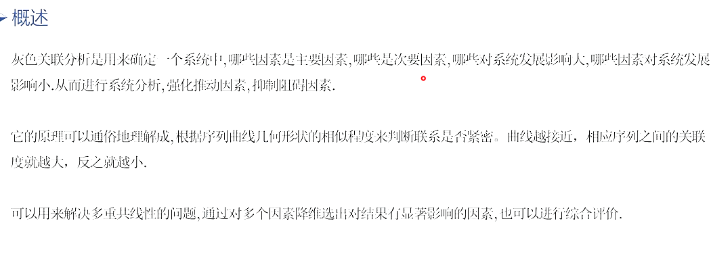
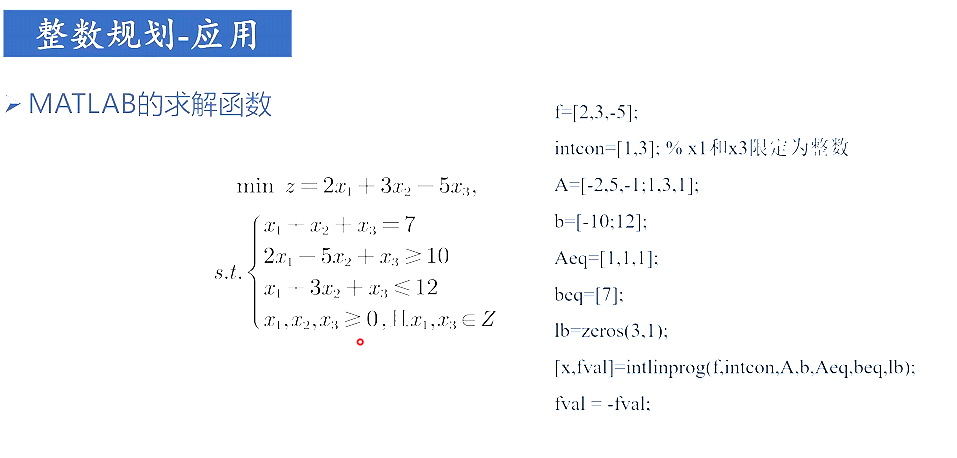

  # 层次分析法

* 只有非一致矩阵才需要进行一致性检测

* ==要先进行一致性检测，通过后才能求权重！！！==

  ## 步骤

  ## 代码实现

~~~matlab
%% 识别判断矩阵
disp('请输入判断矩阵A')
A=input('A=');
[n,n]=size(A);
%% 计算一致性比例CR
CI=(Max_eig-n)/(n-1);
RI=[0 0.0001 0.52 0.89 1.12 1.26 1.36 1.41 1.46 1.49 1.52 1.54 1.56 1.58 1.59];%这里的RI最多支持n等于15
CR=CI/RI(n);
disp('最大特征值为：');
disp(Max_eig);
disp('一致性指标CI=');disp(CI);
disp('一致性比例CR=');disp(CR);
if CR<0.10
    disp('CR<0.01,该判断矩阵的一致性可以接受');
else 
    disp('注意：CR>=0.10,该判断矩阵需要进行修改！');
end
%% 方法1：算术平均法求权重
Sum_A=sum(A);%将矩阵按列去和
SUM_A=repmat(Sum_A,n,1);%将矩阵A作为元素填充到n行1列的矩阵里
Stand_A=A./SUM_A;
disp('计算算数平均值的结果:');
w1=sum(Stand_A,2)./n;
disp(w1)
%% 方法2：特征值法求权重
[V,D]=eig(A);%求矩阵A的全部特征值，构成对角阵D，并求A的向量构成列向量（V中的每一列都是D中与之相同列的特征值的特征向量）
Max_eig=max(max(D));%先行后列，求最大特征值
[r,c]=find(D==Max_eig,1);%找到最大特征值，返回前一个最大特征值的行列值
disp('特征值求权重的结果为：');
w2=V(:,c)./sum(V(:,c));
disp(w2)  
disp('两种方法的平均权值为：  ');
disp((w1+w2)./2); 
~~~

  # 模糊综合评价

* 权重做乘数，矩阵做被乘

  ## 步骤

  ## 代码示例

  ~~~matlab
  eval_mat=[0.8,0.15,0.05,0,0;
            0.2,0.6,0.1,0,0;
            0.5,0.4,0.1,0,0;
            0.1,0.3,0.5,0.05,0.05;
            0.3,0.5,0.15,0.05,0;
            0.2,0.2,0.4,0.1,0.1;
            0.4,0.4,0.1,0.1,0;
            0.1,0.3,0.3,0.2,0.1;
            0.3,0.2,0.2,0.2,0.1;
            0.1,0.3,0.5,0.1,0;
            0.2,0.3,0.3,0.1,0.1;
            0.2,0.3,0.35,0.15,0;
            0.1,0.3,0.4,0.1,0.1;
            0.1,0.4,0.3,0.1,0.1;
            0.3,0.4,0.2,0.1,0;
            0.1,0.4,0.3,0.1,0.1;
            0.2,0.3,0.4,0.1,0;
            0.4,0.3,0.2,0.1,0];
  disp('Eval Matrix:');
  disp(eval_mat);
  
  
  [m,n]=size(eval_mat);
  %disp([m,n]);
  
  %% 将上面的矩阵通过下标进行分组，每一组代表一个属性
  separation_points=[0,4,9,14];
  %然后再输出每一个属性下二级属性的权重
  w_mat={[0.2,0.3,0.3,0.2];
      [0.3,0.2,0.1,0.2,0.2];
      [0.1,0.2,0.3,0.2,0.2];
      [0.3,0.2,0.2,0.3]
      };
  %输出一级属性的权重
  w_vec=[0.4,0.3,0.2,0.1];
  
  %% 计算一级评判向量和二级评判矩阵
  separation_points(end+1)=m;
  eval_mat_seconds=[];%开辟一个空间存放矩阵
  for i=1:length(separation_points)-1
       % 从eval_mat中提取一个子矩阵，计算每个区间的二级评判矩阵
      temp_mat = eval_mat(separation_points(i)+1:separation_points(i+1),:);
      % 使用 w_mat{i} 对 temp_mat 进行加权求和
      eval_mat_seconds = [eval_mat_seconds; w_mat{i} * temp_mat];
  end
  disp("一级评判向量为：");
  disp(eval_mat_seconds);
  
  
  %% 计算二级评判向量，如果只有两级，即为最终结果
  eval_vec=w_vec*eval_mat_seconds;
  disp("最终的评价向量为：");
  disp(eval_vec);
  ~~~

  # 熵权法

  ## 步骤

  - 正向化处理

     

  - 标准化处理

     

  - 计算信息熵和熵权

     

  ## 代码示例

~~~matlab
%% 极小型转极大型，传入参数为待正向化向量，返回为正向化后的结果
function [res] = Min2Max(X)
res=max(X)-X;
end

%% 中间型转极大型，传入参数为待正向化向量，返回为正向化后的结果
function [res]= Mid2Max(X,best)
    M=max(abs(X-best));
    res=1-abs(X-best)/M;
end

%% 区间型转极大型，传入参数为待正向化向量，返回为正向化后的结果
function [res] = Int2Max(X,a,b)
    M=max(a-min(X),max(X)-b);
    for i=1:size(X)
        if(X(i)<a)
            X(i)=1-(a-X(i))/M;
        elseif(X(i)>=a&&X(i)<=b)
            X(i)=1;
        elseif(X(i)>b)
            X(i)=1-(X(i)-b)/M;
        end
    end
    res=X;

end
~~~

  ~~~matlab
  %% 读取excel表
  X=xlsread("D:\Document\Excel\Blind date.xlsx");
  disp(X);
  
  %% 正向化
  disp("正在进行正向化");
  vec=input('请输入正向化向量组，以数组的形式输入，如[1,2,3]表示1，2，3列需要正向化，不需要正向化请输入-1\n');
  if(vec~=-1)
      for i=1:size(vec,2)
          flag=input(['第' num2str(vec(i)) '是那类数据（1.极小型，2.中间型，3.区间型，请输入序号：\n）']);
          if (flag==1)
              X(:,vec(i))=Min2Max( X(:,vec(i)));
          elseif (flag==2)
              best=input('请输入中间值的最好值:\n');
              temp=X(:,vec(i));
              X(:,vec(i))=Mid2Max(X(:,vec(i)),best);
          elseif (flag==3)
              arr=input('请输入最佳区间，按照[a,b]的形式输入:\n');
              X(:,vec(i))=Int2Max(X(:,vec(i)),arr(1),arr(2));
          end
      end
  end
  
  %% 标准化
  disp("正在进行标准化");
  [n,m]=size(X);
  %先检查有没有负元素
  isNeg=0;
  for i=1:n
      for j=1:m
          if(X(i,j)<0)
              isNeg=1;
              break;
          end
      end
  end
  if(isNeg==0)
      squere_x=(X.*X);%平方
      sum_x=sum(squere_x,1).^0.5;%按列求和，在开方
      stand_x=X./repmat(sum_x,n,1);%得到标准化后的结果
  else
      max_x=max(X,[],1);%按列找出最大元素
      min_x=min(X,[],1);%按列找出最小元素
      stand_x=X-repmat(min_x,n,1)./(repmat(max_x,n,1)-repmat(min_x,n,1));
  end
  
  %% 计算样本概率，信息熵和熵权
  disp('正在用熵权法确定权值');
  P=stand_x./repmat(sum(stand_x),n,1);
  %由于概率为ln(0)没有定义，我们需要手动把他调节为和0接近的数
  for i=1:n
      for j=1:m
          if (P(i,j)==0)
              P(i,j)=0.00001;
          end
      end
  end
  H_x=sum(-P.*log(P));%在matlab中，log（x）为ln（x），log10（x）为lg（x）
  e_j=H_x./log(n);
  d_j=1-e_j;
  %进行归一化，获得熵权
  disp('熵权完成，权值为：');
  w=d_j./sum(d_j);
  disp(w);
  ~~~

# TOPSIS

## 步骤

  - 指标正向化

     

  - 标准化

     

  * 用距离法打分

    

  - 用优劣解进行打分

     

  - 确定权重

     

## 代码示例

**==正向化和标准化和熵权法相同==**

  ~~~matlab
  %% 导入数据
  %X=[99,0.010;100,0.012;98,0.040;97,0.033];
  X=xlsread('D:\BaiduNetdiskDownload\第5讲 Topsis\代码\工作簿1.xlsx');
  X=X(:,[2:5]);
  
  %% 正向化
  disp("正在进行正向化")
  vec=input('请输入正向化向量组，以数组的形式输入，如[1,2,3]表示1，2，3列需要正向化，不需要正向化请输入-1\n');
  if(vec~=-1)
      for i=1:size(vec,2)
          flag=input(['第' num2str(vec(i)) '是那类数据（1.极小型，2.中间型，3.区间型，请输入序号：\n）']);
          if (flag==1)
              X(:,vec(i))=Min2Max( X(:,vec(i)));
          elseif (flag==2)
              best=input('请输入中间值的最好值:\n');
              temp=X(:,vec(i));
              X(:,vec(i))=Mid2Max(X(:,vec(i)),best);
          elseif (flag==3)
              arr=input('请输入最佳区间，按照[a,b]的形式输入:\n');
              X(:,vec(i))=Int2Max(X(:,vec(i)),arr(1),arr(2));
          end
      end
      disp("所有数据都已经正向化完成")
  end
  
  %% 标准化
  disp("正在进行标准化");
  [n,m]=size(X);
  %先检查有没有负元素
  isNeg=0;
  for i=1:n
      for j=1:m
          if(X(i,j)<0)
              isNeg=1;
              break;
          end
      end
  end
  if(isNeg==0)
      squere_x=(X.*X);%平方
      sum_x=sum(squere_x,1).^0.5;%按列求和，在开方
      stand_x=X./repmat(sum_x,n,1);%得到标准化后的结果
  else
      max_x=max(X,[],1);%按列找出最大元素
      min_x=min(X,[],1);%按列找出最小元素
      stand_x=X-repmat(min_x,n,1)./(repmat(max_x,n,1)-repmat(min_x,n,1));
  end
  
  %% （法一）用距离法打分
  disp('用距离法打分')
  max_x=max(stand_x,[],1);
  min_x=min(stand_x,[],1);
  
  (stand_x-repmat(min_x,n,1))./(max_x-min_x)
  
  %% 用优劣解打分（先用距离法求解，否则没有min_x和max_x）
  disp('用优劣解打分')
  tmp=ones(m);%生成m行m列的1矩阵
  w_j=tmp(:,1);%取出第一列
  is_need_w=input('是否需要指定权值，如果需要请输入1，否则输入0:\n');
  if(is_need_w==1)
      w_j=input('请按列输入各指标权值，（如[0.1，0.2，0.3，0.4]）');
  end
  z_plus=repmat(max_x,n,1);
  z_sub=repmat(min_x,n,1);
  D_plus=sum(((stand_x-z_plus).^2)*w_j,2).^0.5;
  D_sub=sum(((stand_x-z_sub).^2)*w_j,2).^0.5;
  
  S=D_sub./(D_sub+D_plus);
  
  %将结果归一化
  res_topsis=S./sum(S);
  
  %将结果放入excel表中
  xlswrite('res_Topsis',res_topsis)
  ~~~

# 灰色关联度分析

## 步骤

  - 数据预处理/标准化

     **不同正向化和标准化可能导致结果有差异**！！！

     

  - 确定分析序列

     

  - 确定灰色关联系数

     
     
     

​                                                    ***具体解题步骤***

## 概念

* 作用：确定那些是主要因素，那些是次要因素，消除多重共线性的问题，尽量不要用于综合评价（因为会由于与处理不同，导致结果出现不同）

​                                                            ***同时也可以解决多重共线性问题***

## 代码实现

* 可以直接用excel计算

* 用matlab计算

  ~~~matlab
  %% 导入数据
  X=xlsread('');
  
  %% 正向化
  disp("正在进行正向化")
  vec=input('请输入正向化向量组，以数组的形式输入，如[1,2,3]表示1，2，3列需要正向化，不需要正向化请输入-1\n');
  if(vec~=-1)
      for i=1:size(vec,2)
          flag=input(['第' num2str(vec(i)) '是那类数据（1.极小型，2.中间型，3.区间型，请输入序号：\n）']);
          if (flag==1)
              X(:,vec(i))=Min2Max( X(:,vec(i)));
          elseif (flag==2)
              best=input('请输入中间值的最好值:\n');
              temp=X(:,vec(i));
              X(:,vec(i))=Mid2Max(X(:,vec(i)),best);
          elseif (flag==3)
              arr=input('请输入最佳区间，按照[a,b]的形式输入:\n');
              X(:,vec(i))=Int2Max(X(:,vec(i)),arr(1),arr(2));
          end
      end
      disp("所有数据都已经正向化完成")
  end
  
  %% 标准化
  disp("正在进行标准化");
  [n,m]=size(X);
  %先检查有没有负元素
  isNeg=0;
  for i=1:n
      for j=1:m
          if(X(i,j)<0)
              isNeg=1;
              break;
          end
      end
  end
  if(isNeg==0)
      squere_x=(X.*X);%平方
      sum_x=sum(squere_x,1).^0.5;%按列求和，在开方
      stand_x=X./repmat(sum_x,n,1);%得到标准化后的结果
  else
      max_x=max(X,[],1);%按列找出最大元素
      min_x=min(X,[],1);%按列找出最小元素
      stand_x=X-repmat(min_x,n,1)./(repmat(max_x,n,1)-repmat(min_x,n,1));
  end
  
  %% 灰色关联度分析
  res=stand_x;
  GRE_X=[res,max(res,[],2)];%按行寻找最大数；注意这里我们把x0放到了最后一列
  [m,n]=size(GRE_X);
  gamma_X=zeros(m,n-1);
  for i=1:n-1
      gamma_X(:,i)=abs(GRE_X(:,i)-GRE_X(:,n));
  end
  b=max(max(gamma_X));
  a=min(min(gamma_X));
  roh=0.5;
  gamma_X=(a+roh*b)./(gamma_X+roh*b);
  gre_res=sum(gamma_X)./m;
  ~~~

  

# 线性规划

## 步骤

> 可以通过拉格朗日求最值的方法求得线性规划的解！

### 使用matlab解题步骤（线性规划可能存在无解和无穷解的情况）

* 转化为matlab所能看懂的标准型

* matlab求解函数

  
  
  

## 代码示例

### 例题

### 代码

~~~matlab
f=[-40;-30];
A=[1,-1,0,240;1,0,-1,120]';%在矩阵后加"'"可以转置矩阵
b=[6,-1,-1,1200]';
Aeq=[];
beq=[];
lb=[0;0];%两个变量的下界都是0
ub=[+inf;+inf];%两个变量的上界都是正无穷
[x,val]=linprog(f,A,b,Aeq,beq,lb,ub);%函数中如果不存在某项值，用"[]"来代替，最后的val由于之前转最小值时取负，现在应该在取负才是真正的值
~~~

# 整数规划

## 分类

> 要解决问题

### 第一类

> 整数规划中的特例

#### 解决问题

* 背包问题

* 指派问题

> 两个问题的不同

### 第二类-蒙特卡罗模拟

## 代码实现

~~~matlab
%% 用蒙特卡洛解决建校问题
n=10000;%设置模拟次数
res_min=+Inf;
res_x=0;
for i=1:n
    x=randi([0,1],6,1);%生成一个6*1的0或1向量
    if(x(1)+x(2)+x(3)>=1&x(4)+x(6)>=1&x(3)+x(5)>=1&x(2)+x(4)>=1&x(5)+x(6)>=1&x(1)>=1&x(2)+x(4)+x(6)>=1)
        sum_x=sum(x);
        if(sum_x<res_min)
            res_x=x;
            res_min=sum_x;
        end
    end
end

%% 用蒙特卡洛解决工厂分配设备问题
n=10000;%设置模拟次数
c=[4,2,3,4;
    6,4,5,5;
    7,6,7,5;
    7,8,8,6;
    7,9,8,6;
    7,10,8,6];
res_x=0;
res=0;
for k=1:n
    flag=1;
    x=randi([1,4],1,6);%生成一个1*6的向量，元素为1~4的整数，表示该设备分配给了哪个企业
    for j=1:4%检查每个企业至少分配一台
        if(ismember(j,x)==0) %ismember(j,x)表示x向量中是否有j这个元素，有返回1，没有返回0
            flag=0;
            break;
        end
    end

    if (flag==1)
        sum=0;
        for j=1:6
            sum=sum+c(j,x(j));
        end
        if(sum>res)
            res=sum;
            res_x=x;
        end
    end
end

%% 蒙特卡洛模拟
a=10;%木纹间距
L=5;%表示针的长度
n=100000;%投掷次数
ph=rand(n,1)*pi;%随机抛针，得到角度
x=rand(n,1)*a/2;%针的中心到最近木纹的距离
m=0;%表示相交的次数
y=(L/2)*sin(ph);%恰好相交边界的情况
axis=([0,pi,0,a/2]);%先设置坐标轴
box on;%让图hold住不要动，否则会绘制一张新图
for i=1:n
    if(x(i)<=y(i))
        m=m+1;
        plot(ph(i),x(i),'b.');
        hold on
    end
end
P=m/n;
mypi=2*L/(P*a);

%% 解决张麻子问题
n=10000;%设置模拟次数
x1=round(1+rand(n,1)*5);%round是4舍5入取整的函数
x2=randi([1,6],n,1);
res_x1=0;
res_x2=0;
max_y=0;
for i=1:n
    if(x1(i)+x2(i)<=6)
        if(240*x1(i)+120*x2(i)<=1200)
            if(40*x1(i)+30*x2(i)>max_y)
                max_y=40*x1(i)+30*x2(i);
                res_x1=x1(i);
                res_x2=x2(i);
            end
        end
    end
end
~~~

# 非线性规划

> 线性约束和非线性约束的区别：
>
> 线性约束的最高次项为1次，非线性为多次，三角函数可以转化为泰勒展开式以观察是一次还是多次

## 将非线性转化为matlab标准型

## 例题分析

## 代码示例

~~~matlab
%% 第一个例子讲解
x0=[0 0 0];
A=[-1,1,-1];
b=[0];
[x,val]=fmincon(@f1,x0,A,b,[],[],[],[],@nonlfun1);

%% 第二个例子讲解
x0=[0 0 0];
A=[-1,1,-1];
b=[0];
Aeq=[1,-1,0];
beq=[10];
lb=[10;-Inf;-Inf];
ub=[20;+Inf;+Inf];
[x,val]=fmincon(@f2,x0,A,b,Aeq,beq,lb,ub,@nonlfun2);
val=-val;

function f = f1(x)
    % min f(x) = x(1)^2 + x(2)^2 + x(3)^2 + 8
    f = x(1)^2 + x(2)^2 + x(3)^2 + 8 %这是fmincon函数底层自变量的表示形式，遵守它的规则就好，它会自动分配并计算
end

function f = f2(x)
    % min -f(x) = -x(1)*x(2)*x(3)
    f = -x(1)*x(2)*x(3);
end

function f = f3(x)
    x = x'%由于给的是个行向量，而我们下面的代码是按照列向量算的，所以需要转置
    p1 = 3;
    p2 = 1;
    k1 = 1;
    k2 = 3;
    a = [1.37 9.45 4.43 6.66 3.14 15.92];
    b = [10.21 9.45 8.88 5 16.44 18];
    x1 = 4; y1=1; x2=8; y2=9;
    tmp_x = x ./ (x + 1);                                   %坐标距离
    f = [repmat(p1, 1, 6),repmat(p2, 1, 6)]*x + (sqrt(sum(([a;b] - repmat([x1;y1], 1, 6))) .^ 2)  .* repmat(k1,1,6) * tmp_x([1:6],:) + sqrt(sum(([a;b] - repmat([x2;y2], 1, 6))) .^ 2)  .* repmat(k2,1,6)* tmp_x([7:12],:));

    sum(([a;b] - repmat([x1;y1], 1, 6))) .^ 2
end

function f = f4(delta_theta)
    f = sum(delta_theta .^ 2); %用平方和定义目标函数
end

function [c,ceq] = nonlfun1(x)
    % c表示非线性不等式约束
    c = [x(1) + x(2)^2 + x(3)^2 - 20];
    ceq = [-x(1) - x(2)^2 + 2];
    % ceq表示非线性等式约束
end

function [c,ceq] = nonlfun2(x)
     % c表示非线性不等式约束,如果有多个用分号隔开
     c = [x(1) + x(2)^2 + x(3)^2 - 20; x(1)*x(2) - x(3) - 1];
     % ceq表示非线性等式约束
     ceq = [-x(1) - x(2)^2 + 2];
end

function [c,ceq] = nonlfun4(deleta_theta)
    x = [150 85 150 145 130  0]; % 初始位置的横坐标
    y = [140 85 155  50 150  0]; % 初始位置的纵坐标
    theta = [243 236 220.5 159 230 52] * pi / 180; % 初始的飞行方向角，注意转化为弧度制
    
    %%%%%%========注意绘图时要把速度改小一些才方便观察=========%%%%%%
    v = 800;  % 飞机速度 
    
    % 为了方便，先计算当前时刻调整后的角度值
    co = cos(theta + deleta_theta);
    si = sin(theta + deleta_theta);
    
    d = zeros(6); %用d(i,j)矩阵来记录任意两飞机之间的距离
    
    % 用两层for循环枚举，计算d(i,j)，只需要计算上三角即可
    for i = 1 : 5
        for j = i + 1 : 6
            % 计算我们推导出来的驻点
            fenzi = (x(i) - x(j))*(co(i) - co(j)) + (y(i) - y(j))*(si(i) - si(j));
            fenmu = v * ((co(i) - co(j)).^2 + (si(i) - si(j)).^2);
            t = -1*fenzi/fenmu;
            % 先检查一下驻点的意义
            if (t <= 0)
                d(i,j) = 1000; %此时说明两架飞机是渐行渐远的，一定安全，所以给一个较大的值，但不能给Inf，你可以试试会发生什么
            else
                % 此时驻点有意义，代入
                d(i,j) = ((x(i) + v*t*co(i)) - (x(j) + v*t*co(j))).^2 + ((y(i) + v*t*si(i)) - (y(j) + v*t*si(j))).^2;
            end
            
            %^得到非线性不等式约束，注意原来是>号，要换成<号
            c = repmat(64,15,1) - [d(1,2:6)';d(2,3:6)';d(3,4:6)';d(4,5:6)';d(5,6)'];
        end
    end
    ceq = []; %因为我们没有非线性等式约束，所以设为空
end

~~~

~~~matlab
clear;clc
x0 = [0 0 0 0 0 0];  %设定初始值
lb = -pi/6*ones(6,1); %下界
ub = pi/6*ones(6,1); %上界
[x,fval] = fmincon(@f4,x0,[],[],[],[],lb,ub,@nonlfun4); %注意这里我们是用弧度制 
%% 一些绘图tips
% 我们可以把每次调整后的飞机位置在图中标记上
clear;clc
data = [150	140	243;
    85	85	236;
    150	155	220.5;
    145	50	159;
    130	150	230;
    0	0	52];
plot(data(:,1),data(:,2),'.r')
axis([0 160,0,160]);% 设置坐标轴刻度范围
hold on;
for i = 1:6
    txt = ['飞机',num2str(i)];
    text(data(i,1)+2,data(i,2)+2,txt,'FontSize',8)
end
for i = 1 : 20
    plot(data(:,1),data(:,2),'.r');
    hold on;
    x0 = [0 0 0 0 0 0];  %设定初始值
    lb = -pi/6*ones(6,1); %下界
    ub = pi/6*ones(6,1); %上界
    [x,fval] = fmincon(@f4,x0,[],[],[],[],lb,ub,@nonlfun4); %注意这里我们是用弧度制 
    theta = [243 236 220.5 159 230 52] * pi / 180;
    theta = theta + x;
    %%%%%%%%%%%=========注意这里我们把速度调小了，以方便观察，不要忘记修改nonlfun4里的速度=========%%%%%%%%%%%
    data(:,1) = data(:,1) + 8 * cos(theta)'; 
    data(:,2) = data(:,2) + 8 * sin(theta)';
end
% 最后一步就是把Matlab做出来的图可以导出，然后再放到PPT中画出飞机飞行方向的箭头（就和讲义上的类似）

~~~

~~~matlab

% 先确定Xij的个数一共是2*6=12个
x0 = zeros(1,12);% 给Xij赋初始值
Aeq = [eye(6),eye(6)];% 线性等式的系数矩阵
beq = [5;9;4;8;14;11];% 线性等式的常数项
A = [ones(1,6),zeros(1,6);zeros(1,6),ones(1,6)];% 线性不等式的系数矩阵
b = [30;20];% 线性不等式的常数项
lb = zeros(1,12);
ub = repmat(Inf, 1, 12);
[x,val] = fmincon (@f3, x0, A, b, Aeq, beq, lb, ub, []);

~~~

