# 层次分析法

* 只有非一致矩阵才需要进行一致性检测

* ==要先进行一致性检测，通过后才能求权重！！！==

  ## 步骤

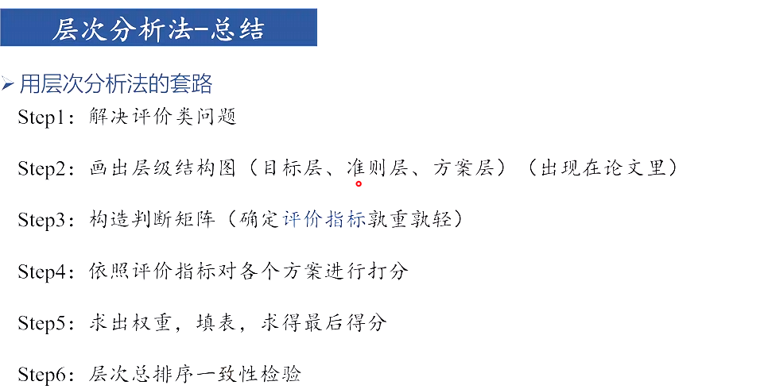

  ## 代码实现

~~~matlab
%% 识别判断矩阵
disp('请输入判断矩阵A')
A=input('A=');
[n,n]=size(A);
%% 计算一致性比例CR
CI=(Max_eig-n)/(n-1);
RI=[0 0.0001 0.52 0.89 1.12 1.26 1.36 1.41 1.46 1.49 1.52 1.54 1.56 1.58 1.59];%这里的RI最多支持n等于15
CR=CI/RI(n);
disp('最大特征值为：');
disp(Max_eig);
disp('一致性指标CI=');disp(CI);
disp('一致性比例CR=');disp(CR);
if CR<0.10
    disp('CR<0.01,该判断矩阵的一致性可以接受');
else 
    disp('注意：CR>=0.10,该判断矩阵需要进行修改！');
end
%% 方法1：算术平均法求权重
Sum_A=sum(A);%将矩阵按列去和
SUM_A=repmat(Sum_A,n,1);%将矩阵A作为元素填充到n行1列的矩阵里
Stand_A=A./SUM_A;
disp('计算算数平均值的结果:');
w1=sum(Stand_A,2)./n;
disp(w1)
%% 方法2：特征值法求权重
[V,D]=eig(A);%求矩阵A的全部特征值，构成对角阵D，并求A的向量构成列向量（V中的每一列都是D中与之相同列的特征值的特征向量）
Max_eig=max(max(D));%先行后列，求最大特征值
[r,c]=find(D==Max_eig,1);%找到最大特征值，返回前一个最大特征值的行列值
disp('特征值求权重的结果为：');
w2=V(:,c)./sum(V(:,c));
disp(w2)  
disp('两种方法的平均权值为：  ');
disp((w1+w2)./2); 
~~~

  # 模糊综合评价

* 权重做乘数，矩阵做被乘

  ## 步骤

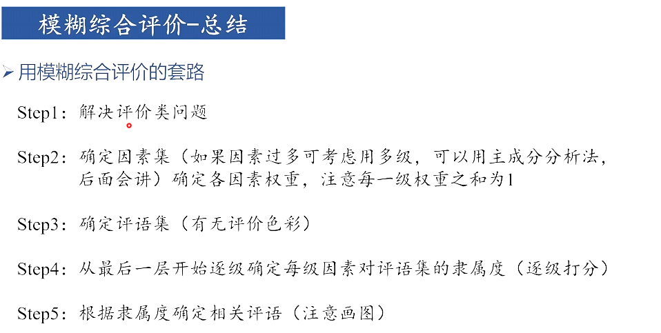

  ## 代码示例

  ~~~matlab
eval_mat=[0.8,0.15,0.05,0,0;
          0.2,0.6,0.1,0,0;
          0.5,0.4,0.1,0,0;
          0.1,0.3,0.5,0.05,0.05;
          0.3,0.5,0.15,0.05,0;
          0.2,0.2,0.4,0.1,0.1;
          0.4,0.4,0.1,0.1,0;
          0.1,0.3,0.3,0.2,0.1;
          0.3,0.2,0.2,0.2,0.1;
          0.1,0.3,0.5,0.1,0;
          0.2,0.3,0.3,0.1,0.1;
          0.2,0.3,0.35,0.15,0;
          0.1,0.3,0.4,0.1,0.1;
          0.1,0.4,0.3,0.1,0.1;
          0.3,0.4,0.2,0.1,0;
          0.1,0.4,0.3,0.1,0.1;
          0.2,0.3,0.4,0.1,0;
          0.4,0.3,0.2,0.1,0];
disp('Eval Matrix:');
disp(eval_mat);

[m,n]=size(eval_mat);
%disp([m,n]);

%% 将上面的矩阵通过下标进行分组，每一组代表一个属性
separation_points=[0,4,9,14];
%然后再输出每一个属性下二级属性的权重
w_mat={[0.2,0.3,0.3,0.2];
    [0.3,0.2,0.1,0.2,0.2];
    [0.1,0.2,0.3,0.2,0.2];
    [0.3,0.2,0.2,0.3]
    };
%输出一级属性的权重
w_vec=[0.4,0.3,0.2,0.1];

%% 计算一级评判向量和二级评判矩阵
separation_points(end+1)=m;
eval_mat_seconds=[];%开辟一个空间存放矩阵
for i=1:length(separation_points)-1
     % 从eval_mat中提取一个子矩阵，计算每个区间的二级评判矩阵
    temp_mat = eval_mat(separation_points(i)+1:separation_points(i+1),:);
    % 使用 w_mat{i} 对 temp_mat 进行加权求和
    eval_mat_seconds = [eval_mat_seconds; w_mat{i} * temp_mat];
end
disp("一级评判向量为：");
disp(eval_mat_seconds);

%% 计算二级评判向量，如果只有两级，即为最终结果
eval_vec=w_vec*eval_mat_seconds;
disp("最终的评价向量为：");
disp(eval_vec);
  ~~~

  # 熵权法

  ## 步骤

  - 正向化处理

    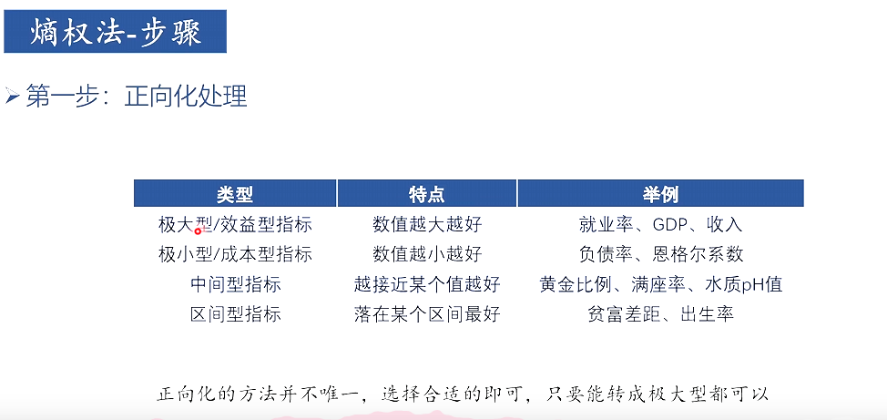

  - 标准化处理

    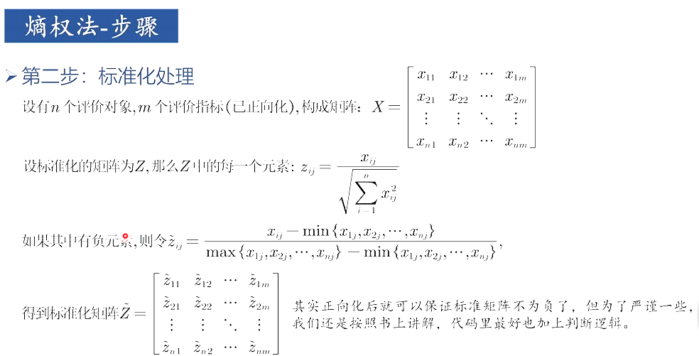

  - 计算信息熵和熵权

    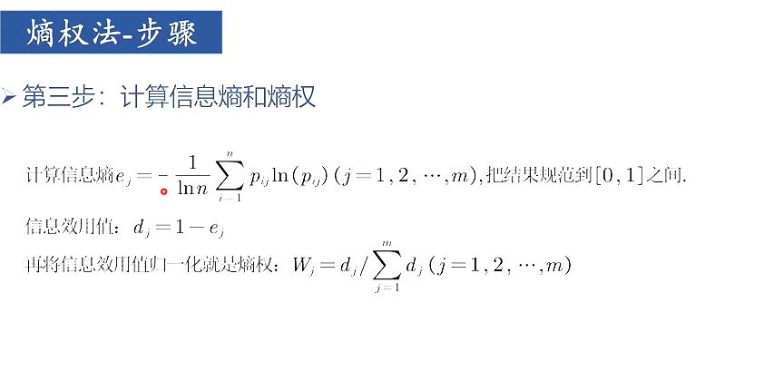

  ## 代码示例

~~~matlab
%% 极小型转极大型，传入参数为待正向化向量，返回为正向化后的结果
function [res] = Min2Max(X)
res=max(X)-X;
end

%% 中间型转极大型，传入参数为待正向化向量，返回为正向化后的结果
function [res]= Mid2Max(X,best)
    M=max(abs(X-best));
    res=1-abs(X-best)/M;
end

%% 区间型转极大型，传入参数为待正向化向量，返回为正向化后的结果
function [res] = Int2Max(X,a,b)
    M=max(a-min(X),max(X)-b);
    for i=1:size(X)
        if(X(i)<a)
            X(i)=1-(a-X(i))/M;
        elseif(X(i)>=a&&X(i)<=b)
            X(i)=1;
        elseif(X(i)>b)
            X(i)=1-(X(i)-b)/M;
        end
    end
    res=X;

end
~~~

  ~~~matlab
%% 读取excel表
X=xlsread("D:\Document\Excel\Blind date.xlsx");
disp(X);

%% 正向化
disp("正在进行正向化");
vec=input('请输入正向化向量组，以数组的形式输入，如[1,2,3]表示1，2，3列需要正向化，不需要正向化请输入-1\n');
if(vec~=-1)
    for i=1:size(vec,2)
        flag=input(['第' num2str(vec(i)) '是那类数据（1.极小型，2.中间型，3.区间型，请输入序号：\n）']);
        if (flag==1)
            X(:,vec(i))=Min2Max( X(:,vec(i)));
        elseif (flag==2)
            best=input('请输入中间值的最好值:\n');
            temp=X(:,vec(i));
            X(:,vec(i))=Mid2Max(X(:,vec(i)),best);
        elseif (flag==3)
            arr=input('请输入最佳区间，按照[a,b]的形式输入:\n');
            X(:,vec(i))=Int2Max(X(:,vec(i)),arr(1),arr(2));
        end
    end
end

%% 标准化
disp("正在进行标准化");
[n,m]=size(X);
%先检查有没有负元素
isNeg=0;
for i=1:n
    for j=1:m
        if(X(i,j)<0)
            isNeg=1;
            break;
        end
    end
end
if(isNeg==0)
    squere_x=(X.*X);%平方
    sum_x=sum(squere_x,1).^0.5;%按列求和，在开方
    stand_x=X./repmat(sum_x,n,1);%得到标准化后的结果
else
    max_x=max(X,[],1);%按列找出最大元素
    min_x=min(X,[],1);%按列找出最小元素
    stand_x=X-repmat(min_x,n,1)./(repmat(max_x,n,1)-repmat(min_x,n,1));
end

%% 计算样本概率，信息熵和熵权
disp('正在用熵权法确定权值');
P=stand_x./repmat(sum(stand_x),n,1);
%由于概率为ln(0)没有定义，我们需要手动把他调节为和0接近的数
for i=1:n
    for j=1:m
        if (P(i,j)==0)
            P(i,j)=0.00001;
        end
    end
end
H_x=sum(-P.*log(P));%在matlab中，log（x）为ln（x），log10（x）为lg（x）
e_j=H_x./log(n);
d_j=1-e_j;
%进行归一化，获得熵权
disp('熵权完成，权值为：');
w=d_j./sum(d_j);
disp(w);
  ~~~

# TOPSIS

## 步骤

  - 指标正向化

    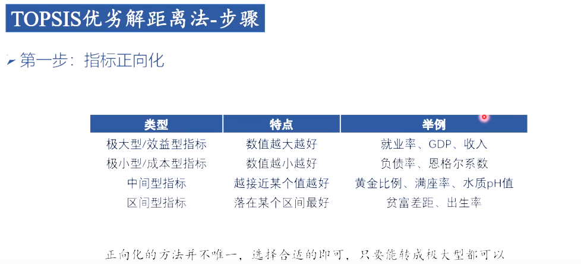

  - 标准化

    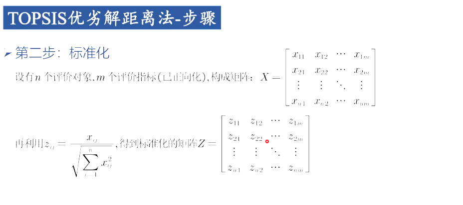

  * 用距离法打分

    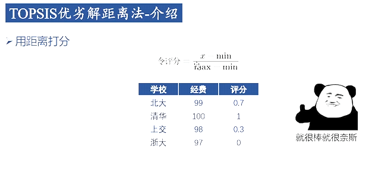

  - 用优劣解进行打分

    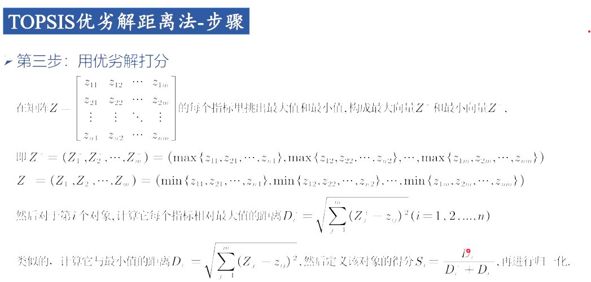

  - 确定权重

    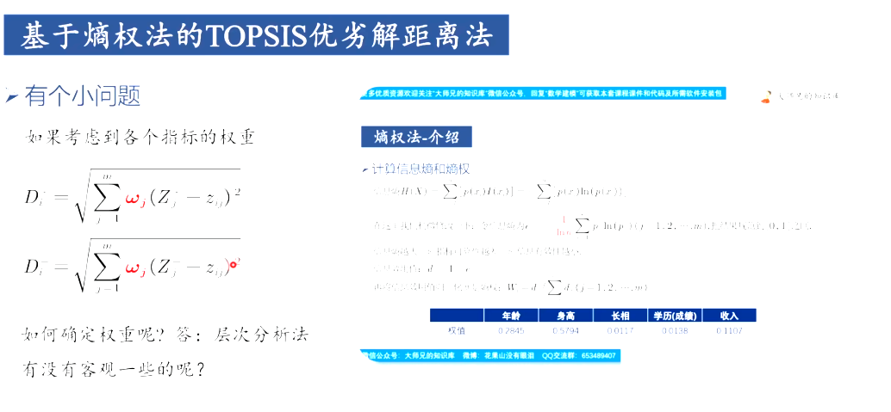

## 代码示例

**==正向化和标准化和熵权法相同==**

  ~~~matlab
%% 导入数据
%X=[99,0.010;100,0.012;98,0.040;97,0.033];
X=xlsread('D:\BaiduNetdiskDownload\第5讲 Topsis\代码\工作簿1.xlsx');
X=X(:,[2:5]);

%% 正向化
disp("正在进行正向化")
vec=input('请输入正向化向量组，以数组的形式输入，如[1,2,3]表示1，2，3列需要正向化，不需要正向化请输入-1\n');
if(vec~=-1)
    for i=1:size(vec,2)
        flag=input(['第' num2str(vec(i)) '是那类数据（1.极小型，2.中间型，3.区间型，请输入序号：\n）']);
        if (flag==1)
            X(:,vec(i))=Min2Max( X(:,vec(i)));
        elseif (flag==2)
            best=input('请输入中间值的最好值:\n');
            temp=X(:,vec(i));
            X(:,vec(i))=Mid2Max(X(:,vec(i)),best);
        elseif (flag==3)
            arr=input('请输入最佳区间，按照[a,b]的形式输入:\n');
            X(:,vec(i))=Int2Max(X(:,vec(i)),arr(1),arr(2));
        end
    end
    disp("所有数据都已经正向化完成")
end

%% 标准化
disp("正在进行标准化");
[n,m]=size(X);
%先检查有没有负元素
isNeg=0;
for i=1:n
    for j=1:m
        if(X(i,j)<0)
            isNeg=1;
            break;
        end
    end
end
if(isNeg==0)
    squere_x=(X.*X);%平方
    sum_x=sum(squere_x,1).^0.5;%按列求和，在开方
    stand_x=X./repmat(sum_x,n,1);%得到标准化后的结果
else
    max_x=max(X,[],1);%按列找出最大元素
    min_x=min(X,[],1);%按列找出最小元素
    stand_x=X-repmat(min_x,n,1)./(repmat(max_x,n,1)-repmat(min_x,n,1));
end

%% （法一）用距离法打分
disp('用距离法打分')
max_x=max(stand_x,[],1);
min_x=min(stand_x,[],1);

(stand_x-repmat(min_x,n,1))./(max_x-min_x)

%% 用优劣解打分（先用距离法求解，否则没有min_x和max_x）
disp('用优劣解打分')
tmp=ones(m);%生成m行m列的1矩阵
w_j=tmp(:,1);%取出第一列
is_need_w=input('是否需要指定权值，如果需要请输入1，否则输入0:\n');
if(is_need_w==1)
    w_j=input('请按列输入各指标权值，（如[0.1，0.2，0.3，0.4]）');
end
z_plus=repmat(max_x,n,1);
z_sub=repmat(min_x,n,1);
D_plus=sum(((stand_x-z_plus).^2)*w_j,2).^0.5;
D_sub=sum(((stand_x-z_sub).^2)*w_j,2).^0.5;

S=D_sub./(D_sub+D_plus);

%将结果归一化
res_topsis=S./sum(S);

%将结果放入excel表中
xlswrite('res_Topsis',res_topsis)
  ~~~

# 灰色关联度分析

## 步骤

  - 数据预处理/标准化

    **不同正向化和标准化可能导致结果有差异**！！！

    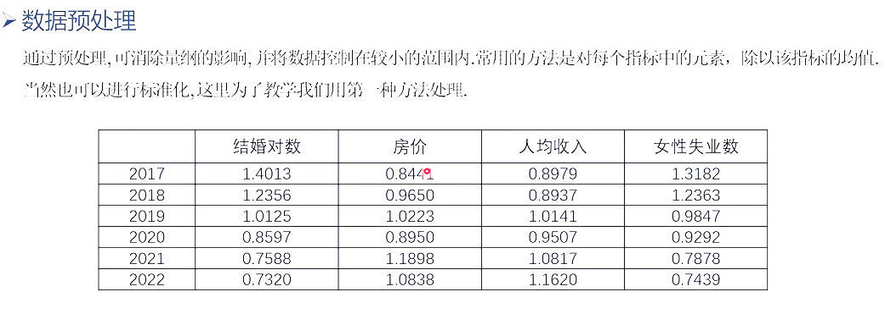

  - 确定分析序列

    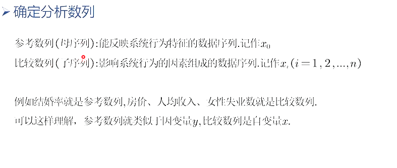

  - 确定灰色关联系数

    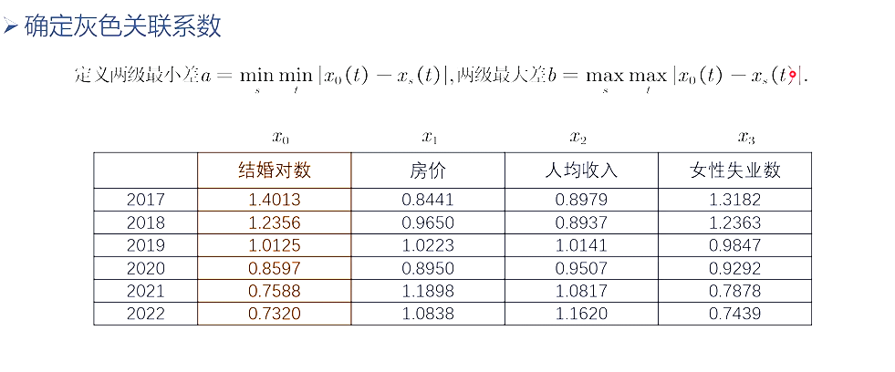

    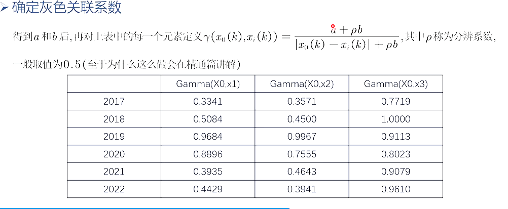

​                                                    ***具体解题步骤***

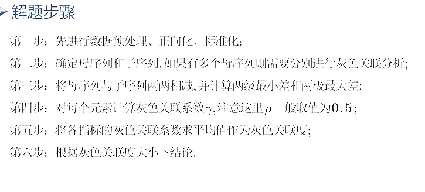

## 概念

* 作用：确定那些是主要因素，那些是次要因素，消除多重共线性的问题，尽量不要用于综合评价（因为会由于与处理不同，导致结果出现不同）

​                                                            ***同时也可以解决多重共线性问题***

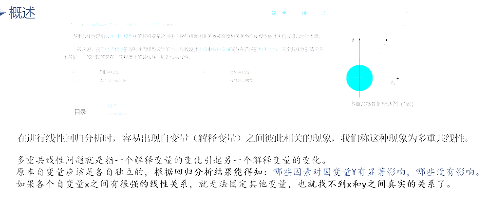

## 代码实现

* 可以直接用excel计算

* 用matlab计算

  ~~~matlab
  %% 导入数据
  X=xlsread('');
  
  %% 正向化
  disp("正在进行正向化")
  vec=input('请输入正向化向量组，以数组的形式输入，如[1,2,3]表示1，2，3列需要正向化，不需要正向化请输入-1\n');
  if(vec~=-1)
      for i=1:size(vec,2)
          flag=input(['第' num2str(vec(i)) '是那类数据（1.极小型，2.中间型，3.区间型，请输入序号：\n）']);
          if (flag==1)
              X(:,vec(i))=Min2Max( X(:,vec(i)));
          elseif (flag==2)
              best=input('请输入中间值的最好值:\n');
              temp=X(:,vec(i));
              X(:,vec(i))=Mid2Max(X(:,vec(i)),best);
          elseif (flag==3)
              arr=input('请输入最佳区间，按照[a,b]的形式输入:\n');
              X(:,vec(i))=Int2Max(X(:,vec(i)),arr(1),arr(2));
          end
      end
      disp("所有数据都已经正向化完成")
  end
  
  %% 标准化
  disp("正在进行标准化");
  [n,m]=size(X);
  %先检查有没有负元素
  isNeg=0;
  for i=1:n
      for j=1:m
          if(X(i,j)<0)
              isNeg=1;
              break;
          end
      end
  end
  if(isNeg==0)
      squere_x=(X.*X);%平方
      sum_x=sum(squere_x,1).^0.5;%按列求和，在开方
      stand_x=X./repmat(sum_x,n,1);%得到标准化后的结果
  else
      max_x=max(X,[],1);%按列找出最大元素
      min_x=min(X,[],1);%按列找出最小元素
      stand_x=X-repmat(min_x,n,1)./(repmat(max_x,n,1)-repmat(min_x,n,1));
  end
  
  %% 灰色关联度分析
  res=stand_x;
  GRE_X=[res,max(res,[],2)];%按行寻找最大数；注意这里我们把x0放到了最后一列
  [m,n]=size(GRE_X);
  gamma_X=zeros(m,n-1);
  for i=1:n-1
      gamma_X(:,i)=abs(GRE_X(:,i)-GRE_X(:,n));
  end
  b=max(max(gamma_X));
  a=min(min(gamma_X));
  roh=0.5;
  gamma_X=(a+roh*b)./(gamma_X+roh*b);
  gre_res=sum(gamma_X)./m;
  ~~~

  

# 线性规划

## 步骤

> 可以通过拉格朗日求最值的方法求得线性规划的解！

### 使用matlab解题步骤（线性规划可能存在无解和无穷解的情况）

* 转化为matlab所能看懂的标准型

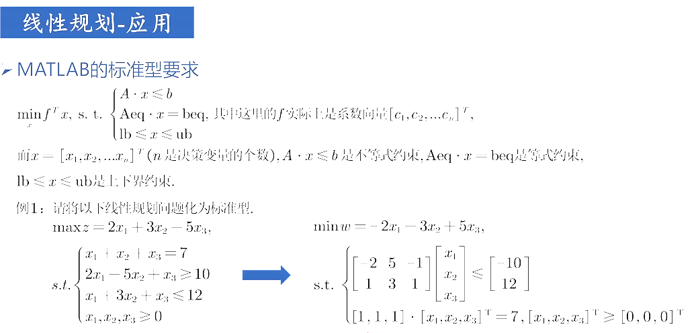

* matlab求解函数

  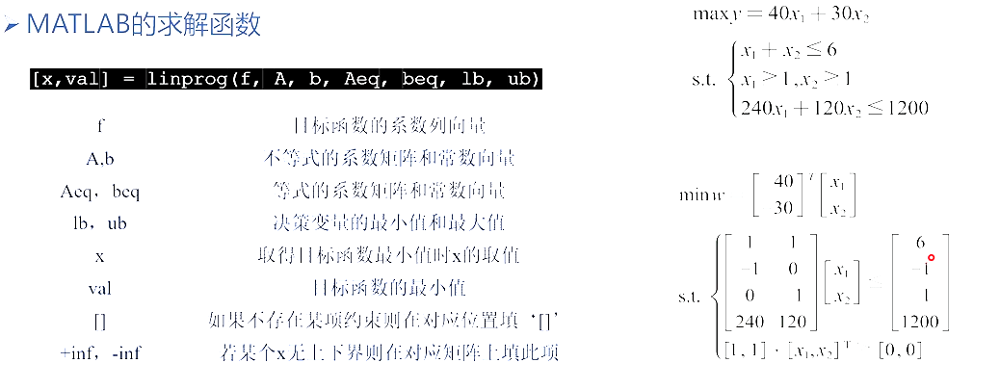

  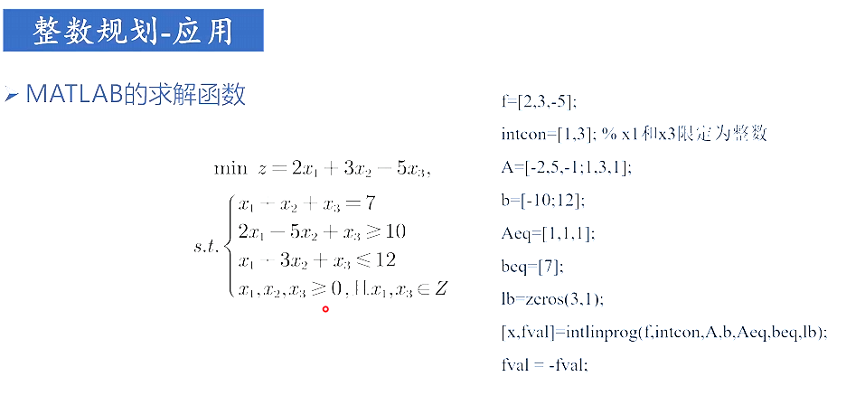

## 代码示例

### 例题

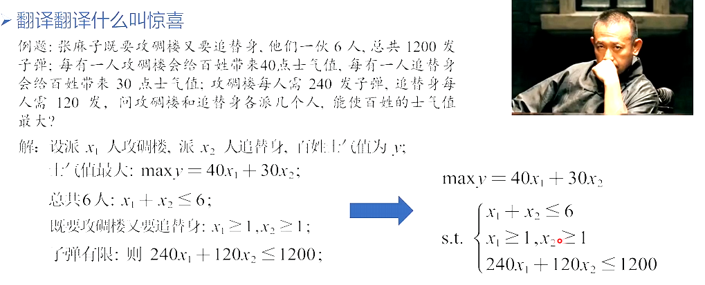

### 代码

~~~matlab
f=[-40;-30];
A=[1,-1,0,240;1,0,-1,120]';%在矩阵后加"'"可以转置矩阵
b=[6,-1,-1,1200]';
Aeq=[];
beq=[];
lb=[0;0];%两个变量的下界都是0
ub=[+inf;+inf];%两个变量的上界都是正无穷
[x,val]=linprog(f,A,b,Aeq,beq,lb,ub);%函数中如果不存在某项值，用"[]"来代替，最后的val由于之前转最小值时取负，现在应该在取负才是真正的值
~~~

# 整数规划

## 分类

> 要解决问题

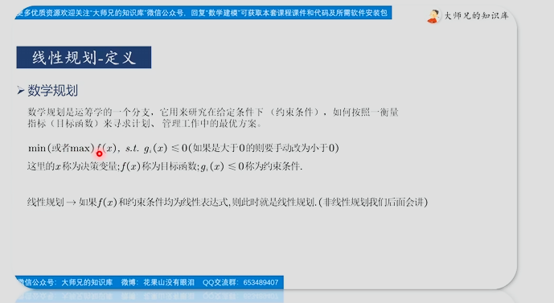

### 第一类

> 整数规划中的特例

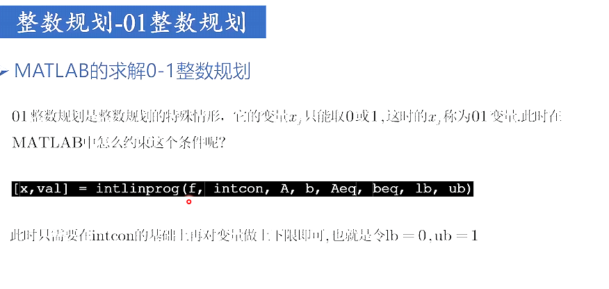

#### 解决问题

* 背包问题

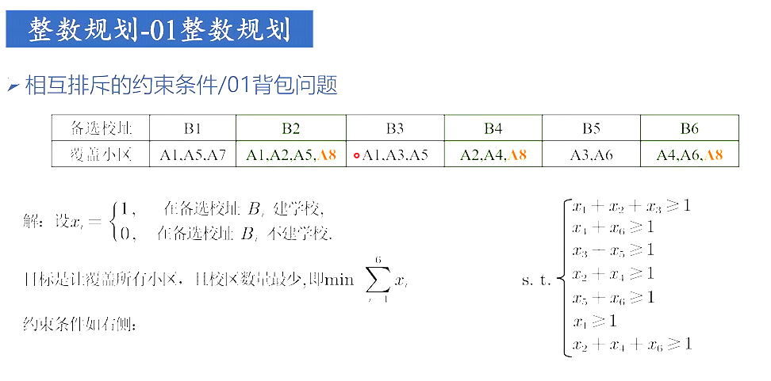

* 指派问题

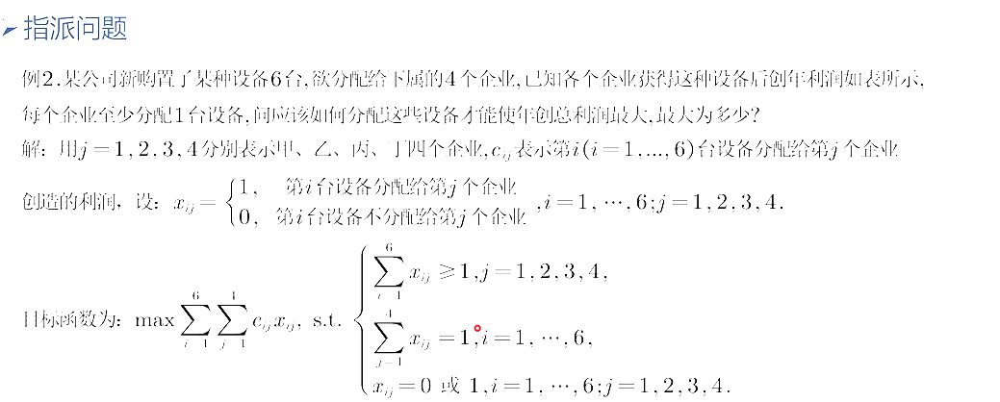

> 两个问题的不同

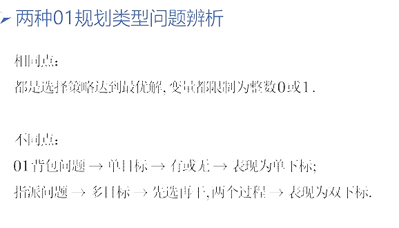

### 第二类-蒙特卡罗模拟

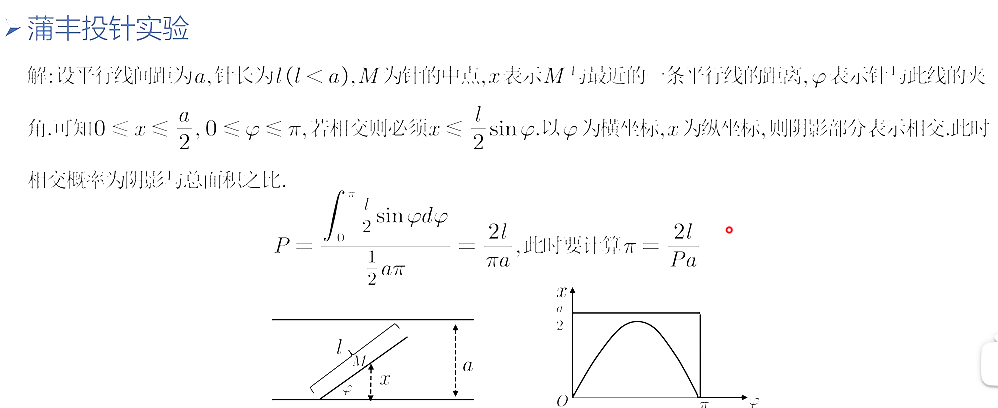

## 代码实现

~~~matlab
%% 用蒙特卡洛解决建校问题
n=10000;%设置模拟次数
res_min=+Inf;
res_x=0;
for i=1:n
    x=randi([0,1],6,1);%生成一个6*1的0或1向量
    if(x(1)+x(2)+x(3)>=1&x(4)+x(6)>=1&x(3)+x(5)>=1&x(2)+x(4)>=1&x(5)+x(6)>=1&x(1)>=1&x(2)+x(4)+x(6)>=1)
        sum_x=sum(x);
        if(sum_x<res_min)
            res_x=x;
            res_min=sum_x;
        end
    end
end

%% 用蒙特卡洛解决工厂分配设备问题
n=10000;%设置模拟次数
c=[4,2,3,4;
    6,4,5,5;
    7,6,7,5;
    7,8,8,6;
    7,9,8,6;
    7,10,8,6];
res_x=0;
res=0;
for k=1:n
    flag=1;
    x=randi([1,4],1,6);%生成一个1*6的向量，元素为1~4的整数，表示该设备分配给了哪个企业
    for j=1:4%检查每个企业至少分配一台
        if(ismember(j,x)==0) %ismember(j,x)表示x向量中是否有j这个元素，有返回1，没有返回0
            flag=0;
            break;
        end
    end

    if (flag==1)
        sum=0;
        for j=1:6
            sum=sum+c(j,x(j));
        end
        if(sum>res)
            res=sum;
            res_x=x;
        end
    end
end

%% 蒙特卡洛模拟
a=10;%木纹间距
L=5;%表示针的长度
n=100000;%投掷次数
ph=rand(n,1)*pi;%随机抛针，得到角度
x=rand(n,1)*a/2;%针的中心到最近木纹的距离
m=0;%表示相交的次数
y=(L/2)*sin(ph);%恰好相交边界的情况
axis=([0,pi,0,a/2]);%先设置坐标轴
box on;%让图hold住不要动，否则会绘制一张新图
for i=1:n
    if(x(i)<=y(i))
        m=m+1;
        plot(ph(i),x(i),'b.');
        hold on
    end
end
P=m/n;
mypi=2*L/(P*a);

%% 解决张麻子问题
n=10000;%设置模拟次数
x1=round(1+rand(n,1)*5);%round是4舍5入取整的函数
x2=randi([1,6],n,1);
res_x1=0;
res_x2=0;
max_y=0;
for i=1:n
    if(x1(i)+x2(i)<=6)
        if(240*x1(i)+120*x2(i)<=1200)
            if(40*x1(i)+30*x2(i)>max_y)
                max_y=40*x1(i)+30*x2(i);
                res_x1=x1(i);
                res_x2=x2(i);
            end
        end
    end
end
~~~

# 非线性规划

> 线性约束和非线性约束的区别：
>
> 线性约束的最高次项为1次，非线性为多次，三角函数可以转化为泰勒展开式以观察是一次还是多次

## 将非线性转化为matlab标准型

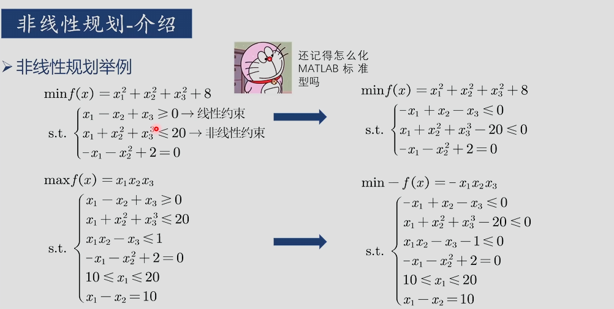

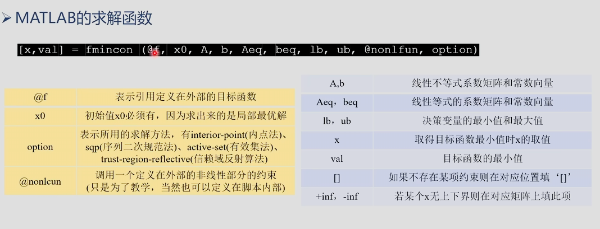

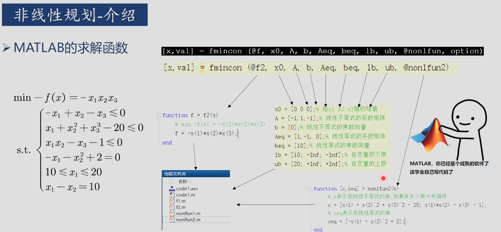

## 例题分析

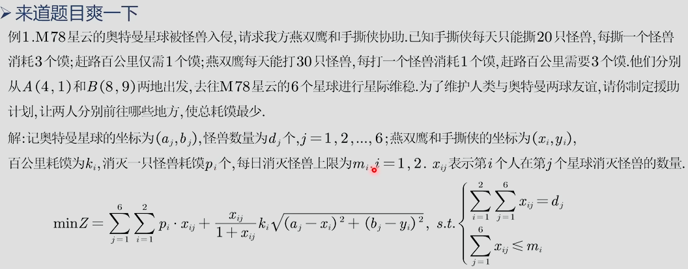

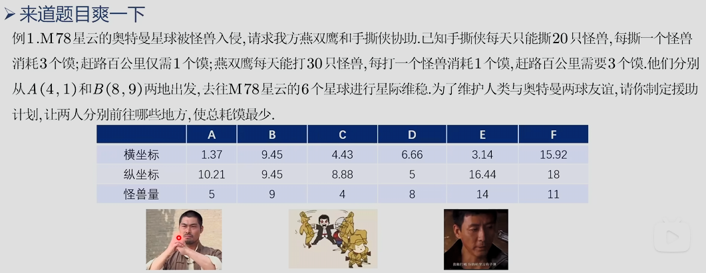

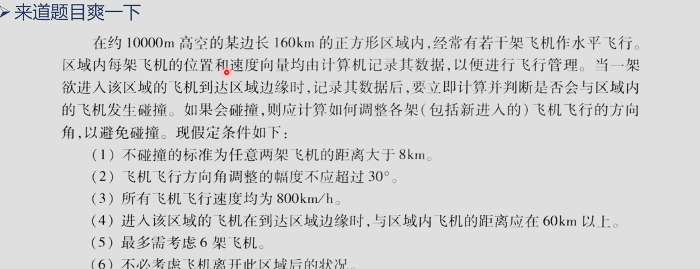

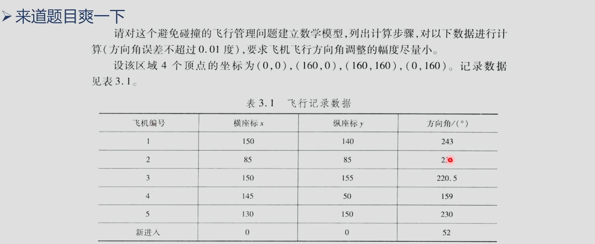

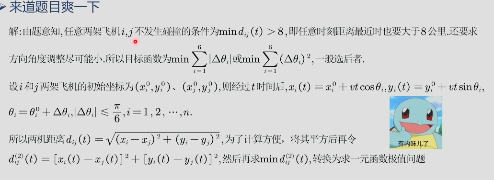

## 代码示例

~~~matlab
%% 第一个例子讲解
x0=[0 0 0];
A=[-1,1,-1];
b=[0];
[x,val]=fmincon(@f1,x0,A,b,[],[],[],[],@nonlfun1);

%% 第二个例子讲解
x0=[0 0 0];
A=[-1,1,-1];
b=[0];
Aeq=[1,-1,0];
beq=[10];
lb=[10;-Inf;-Inf];
ub=[20;+Inf;+Inf];
[x,val]=fmincon(@f2,x0,A,b,Aeq,beq,lb,ub,@nonlfun2);
val=-val;

function f = f1(x)
    % min f(x) = x(1)^2 + x(2)^2 + x(3)^2 + 8
    f = x(1)^2 + x(2)^2 + x(3)^2 + 8 %这是fmincon函数底层自变量的表示形式，遵守它的规则就好，它会自动分配并计算
end

function f = f2(x)
    % min -f(x) = -x(1)*x(2)*x(3)
    f = -x(1)*x(2)*x(3);
end

function f = f3(x)
    x = x'%由于给的是个行向量，而我们下面的代码是按照列向量算的，所以需要转置
    p1 = 3;
    p2 = 1;
    k1 = 1;
    k2 = 3;
    a = [1.37 9.45 4.43 6.66 3.14 15.92];
    b = [10.21 9.45 8.88 5 16.44 18];
    x1 = 4; y1=1; x2=8; y2=9;
    tmp_x = x ./ (x + 1);                                   %坐标距离
    f = [repmat(p1, 1, 6),repmat(p2, 1, 6)]*x + (sqrt(sum(([a;b] - repmat([x1;y1], 1, 6))) .^ 2)  .* repmat(k1,1,6) * tmp_x([1:6],:) + sqrt(sum(([a;b] - repmat([x2;y2], 1, 6))) .^ 2)  .* repmat(k2,1,6)* tmp_x([7:12],:));

    sum(([a;b] - repmat([x1;y1], 1, 6))) .^ 2
end

function f = f4(delta_theta)
    f = sum(delta_theta .^ 2); %用平方和定义目标函数
end

function [c,ceq] = nonlfun1(x)
    % c表示非线性不等式约束
    c = [x(1) + x(2)^2 + x(3)^2 - 20];
    ceq = [-x(1) - x(2)^2 + 2];
    % ceq表示非线性等式约束
end

function [c,ceq] = nonlfun2(x)
     % c表示非线性不等式约束,如果有多个用分号隔开
     c = [x(1) + x(2)^2 + x(3)^2 - 20; x(1)*x(2) - x(3) - 1];
     % ceq表示非线性等式约束
     ceq = [-x(1) - x(2)^2 + 2];
end

function [c,ceq] = nonlfun4(deleta_theta)
    x = [150 85 150 145 130  0]; % 初始位置的横坐标
    y = [140 85 155  50 150  0]; % 初始位置的纵坐标
    theta = [243 236 220.5 159 230 52] * pi / 180; % 初始的飞行方向角，注意转化为弧度制
    
    %%%%%%========注意绘图时要把速度改小一些才方便观察=========%%%%%%
    v = 800;  % 飞机速度 
    
    % 为了方便，先计算当前时刻调整后的角度值
    co = cos(theta + deleta_theta);
    si = sin(theta + deleta_theta);
    
    d = zeros(6); %用d(i,j)矩阵来记录任意两飞机之间的距离
    
    % 用两层for循环枚举，计算d(i,j)，只需要计算上三角即可
    for i = 1 : 5
        for j = i + 1 : 6
            % 计算我们推导出来的驻点
            fenzi = (x(i) - x(j))*(co(i) - co(j)) + (y(i) - y(j))*(si(i) - si(j));
            fenmu = v * ((co(i) - co(j)).^2 + (si(i) - si(j)).^2);
            t = -1*fenzi/fenmu;
            % 先检查一下驻点的意义
            if (t <= 0)
                d(i,j) = 1000; %此时说明两架飞机是渐行渐远的，一定安全，所以给一个较大的值，但不能给Inf，你可以试试会发生什么
            else
                % 此时驻点有意义，代入
                d(i,j) = ((x(i) + v*t*co(i)) - (x(j) + v*t*co(j))).^2 + ((y(i) + v*t*si(i)) - (y(j) + v*t*si(j))).^2;
            end
            
            %^得到非线性不等式约束，注意原来是>号，要换成<号
            c = repmat(64,15,1) - [d(1,2:6)';d(2,3:6)';d(3,4:6)';d(4,5:6)';d(5,6)'];
        end
    end
    ceq = []; %因为我们没有非线性等式约束，所以设为空
end

~~~

~~~matlab
clear;clc
x0 = [0 0 0 0 0 0];  %设定初始值
lb = -pi/6*ones(6,1); %下界
ub = pi/6*ones(6,1); %上界
[x,fval] = fmincon(@f4,x0,[],[],[],[],lb,ub,@nonlfun4); %注意这里我们是用弧度制 
%% 一些绘图tips
% 我们可以把每次调整后的飞机位置在图中标记上
clear;clc
data = [150	140	243;
    85	85	236;
    150	155	220.5;
    145	50	159;
    130	150	230;
    0	0	52];
plot(data(:,1),data(:,2),'.r')
axis([0 160,0,160]);% 设置坐标轴刻度范围
hold on;
for i = 1:6
    txt = ['飞机',num2str(i)];
    text(data(i,1)+2,data(i,2)+2,txt,'FontSize',8)
end
for i = 1 : 20
    plot(data(:,1),data(:,2),'.r');
    hold on;
    x0 = [0 0 0 0 0 0];  %设定初始值
    lb = -pi/6*ones(6,1); %下界
    ub = pi/6*ones(6,1); %上界
    [x,fval] = fmincon(@f4,x0,[],[],[],[],lb,ub,@nonlfun4); %注意这里我们是用弧度制 
    theta = [243 236 220.5 159 230 52] * pi / 180;
    theta = theta + x;
    %%%%%%%%%%%=========注意这里我们把速度调小了，以方便观察，不要忘记修改nonlfun4里的速度=========%%%%%%%%%%%
    data(:,1) = data(:,1) + 8 * cos(theta)'; 
    data(:,2) = data(:,2) + 8 * sin(theta)';
end
% 最后一步就是把Matlab做出来的图可以导出，然后再放到PPT中画出飞机飞行方向的箭头（就和讲义上的类似）

~~~

~~~matlab
% 先确定Xij的个数一共是2*6=12个
x0 = zeros(1,12);% 给Xij赋初始值
Aeq = [eye(6),eye(6)];% 线性等式的系数矩阵
beq = [5;9;4;8;14;11];% 线性等式的常数项
A = [ones(1,6),zeros(1,6);zeros(1,6),ones(1,6)];% 线性不等式的系数矩阵
b = [30;20];% 线性不等式的常数项
lb = zeros(1,12);
ub = repmat(Inf, 1, 12);
[x,val] = fmincon (@f3, x0, A, b, Aeq, beq, lb, ub, []);

~~~

# 图论与最短路径

## 例题分析

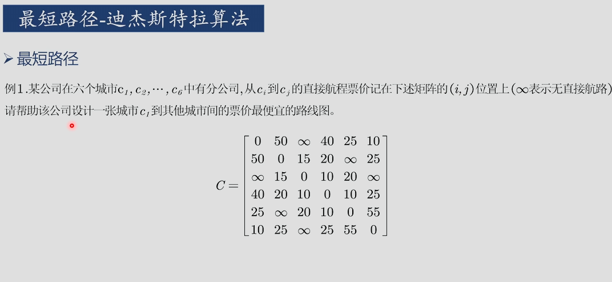

* 其他方法解决

  ==整数规划==

  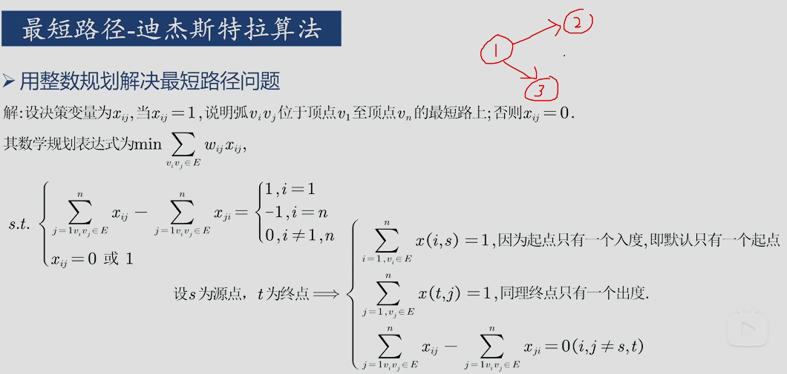

  ==蒙特卡洛==

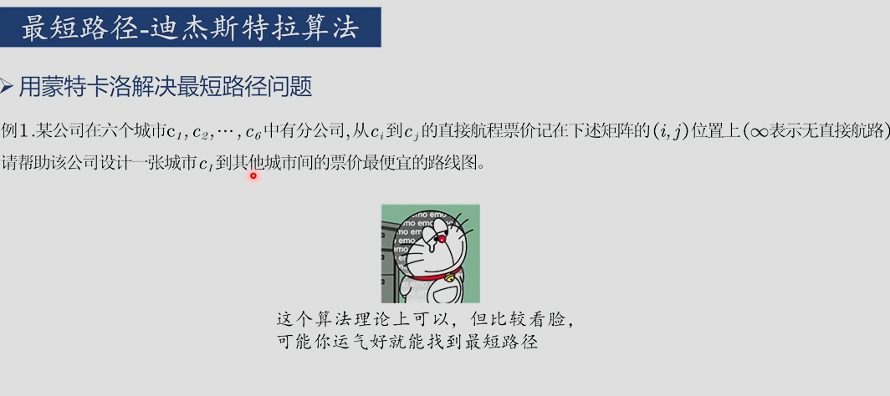

## matlab求解

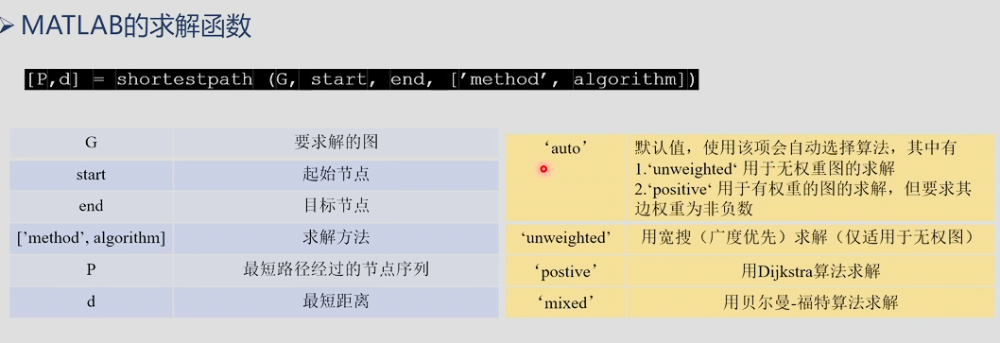

## 代码求解

~~~matlab
%% 绘制数字标号的图
s=[1 2 3];%s为起始点，注意标号要从1开始，不能从0开始
t=[4 1 2]; %t为尾节点
w=[5 2 6];%w为权重，意思为1到4的权重为5；2到1的权重为2；3到2的权重为6
%绘制到权重的图
G=graph(s,t,w);
plot(G,'EdgeLabel',G.Edges.Weight,'LineWidth',2);
%绘制不带权重的图
%G2=graph(s,t);
%plot(G2,"LineWidth",2);
set(gca,'XTick',[],'YTick',[]);%去掉坐标轴上的数字

%% 绘制字符串标号的图
s={'北京','上海','广州','深圳','上海'};%定义元胞数组
t={'上海','广州','深圳','北京','深圳'};
w=[10 65 3 90 60];
G=graph(s,t,w);
plot(G,'EdgeLabel',G.Edges.Weight,'LineWidth',2);
set(gca,'XTick',[],'YTick',[]);

%% 重点绘制邻接矩阵的图
c = [0 15 10 20 0 0 0 0;
     0 0 0 0 7 10 0 0;
     0 0 0 0 0 8 2 0;
     0 0 0 0 0 0 18 0;
     0 0 0 0 0 0 0 6;
     0 0 0 0 0 0 0 16;
     0 0 0 0 0 0 0 20;
     0 0 0 0 0 0 0 0];

%view(biograph(c, [], 'ShowWeights', 'on'));%   biograph在新版matlab中被移除了

% 创建有向图
G = digraph(c);

% 自动生成节点名称
nodeNames = strcat('Node ', string((1:size(c, 1))));

% 绘制图
figure;
p = plot(G, 'Layout', 'layered', 'EdgeLabel', G.Edges.Weight);

% 设置节点名称
p.NodeLabel = nodeNames;

% 设置节点和边的样式
p.NodeColor = 'yellow'; % 设置节点颜色为黄色
p.EdgeColor = 'black'; % 设置边颜色为黑色
p.MarkerSize = 10; % 设置节点大小
p.NodeFontSize = 12; % 设置节点字体大小
p.EdgeFontSize = 10; % 设置边字体大小
p.LineWidth = 1.5; % 设置边线宽度

% 计算最短路径
% 假设我们要找到从节点1到节点8的最短路径
[startNode, endNode] = deal(1, 8);
[path, pathLength] = shortestpath(G, startNode, endNode);

% 显示最短路径
disp(['Shortest path from node ' num2str(startNode) ' to node ' num2str(endNode) ':']);
disp(path);
disp(['Path length: ' num2str(pathLength)]);

% 突出显示最短路径
highlight(p, path, 'EdgeColor', 'r', 'MarkerSize', 12, 'LineWidth', 2);

%% 用蒙特卡洛解决最短路径问题（了解即可，不用掌握）
%此图为对称矩阵，是一个无向图
C = [0 50 999 40 25 10;
    50 0 15 20 999 25;
    999 15 0 10 20 999;
    40 20 10 0 10 25;
    25 999 20 10 0 55;
    10 25 999 25 55 0];
 s = [+Inf, +Inf, +Inf, +Inf, +Inf, +Inf];
 for k = 1 : 10000     
     D = randi(([0 1]),6);
     % 从c1开始
     for i = 1 : 6 %目标城市       
         isconnect = 0;
         dist = 0;
         for j = i + 1 : 6 %j表示跳板城市，用j枚举城市检查是否连通，因为是一个无向图，也就是有回路的，所以只需要考虑上三角即可
            if(D(1,j) == 1) %表示c1和跳板城市有连通
                %检查跳板城市能否到达目标城市，如果不能就找跳板的跳板城市
                dist = dist + C(1,j);
                [r_isconnect r_dist] = find_Path(C, D, j, i, dist);
                if (r_isconnect == 1)
                    isconnect = 1;
                    break;
                end
                %如果c1和跳板不连通，找下一个连通的城市
            end
         end
         if isconnect == 1 %记录当前模拟的路径距离
             s(i) = dist;
         end
     end
 end
 %% Dijkstra
 %注意，matlab图节点要从1开始编号
 s = [1 1 2 2 8 8 3 9 3 3 7  4  4 6];
t = [2 8 8 3 9 7 9 7 4 6 6  6  5 5];
w = [4 8 3 8 1 6 2 6 7 4 2 14 9 10];
G = graph(s,t,w);%将对称矩阵转化为图对象，只能处理无向图，因为无向图的邻接矩阵是对称的；如果是有向图使用digraph函数
plot(G, 'EdgeLabel', G.Edges.Weight, 'linewidth', 2) 
set( gca, 'XTick', [], 'YTick', [] ); %去掉坐标轴上的数字
[P,d] = shortestpath(G, 1, 5);  %计算从1到9的最短路径,第二个参数为起始点，第三个参数为终止点，注意，起始点和终止点都要加1，原来的点是1到4
~~~

# 网络最大流量问题

## 基本概念

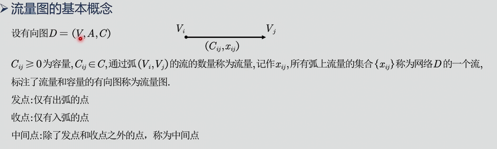

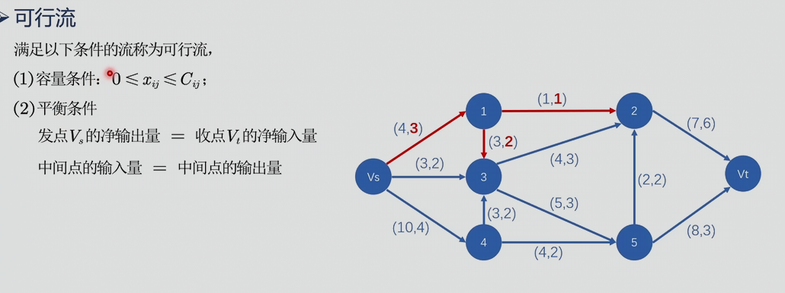

### 增广链

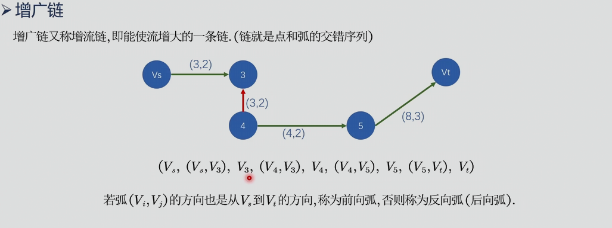

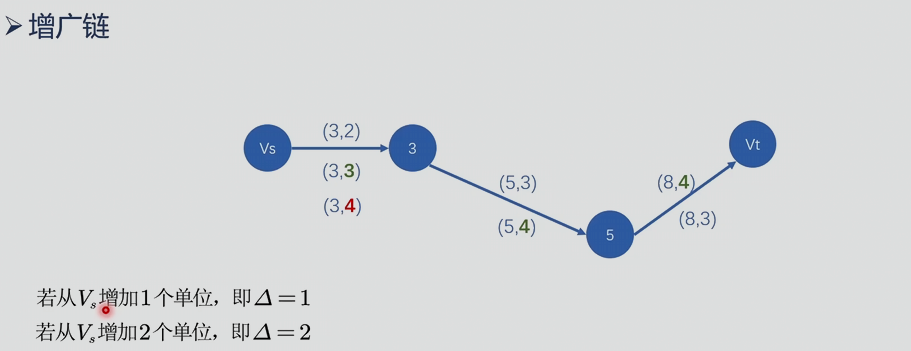

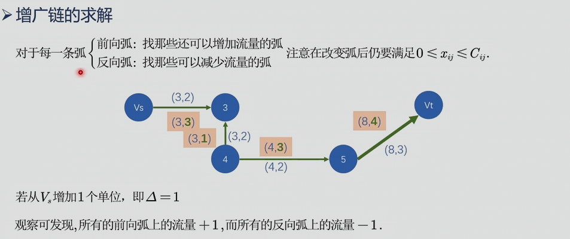

### 最大流解法-Ford Fulkerson算法

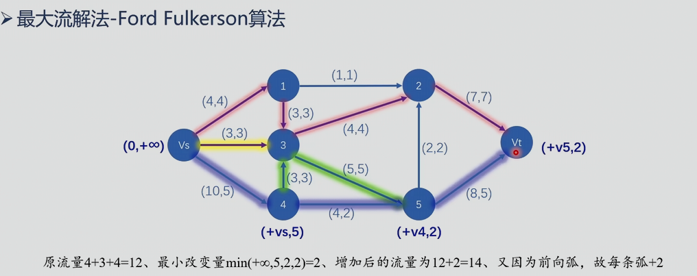

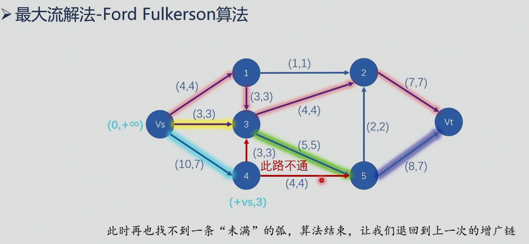

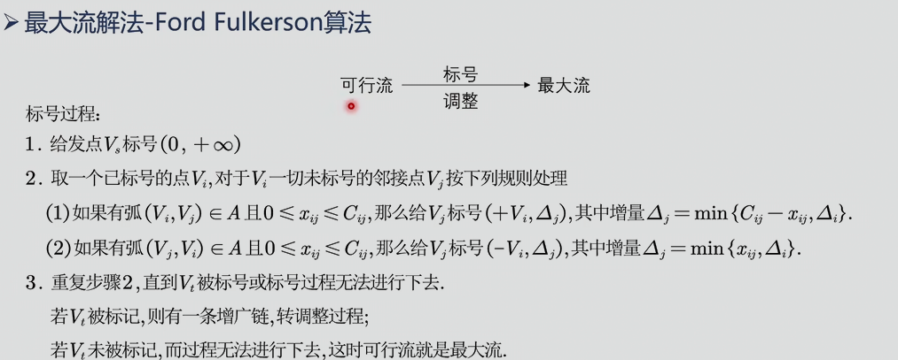

### matlab求解函数

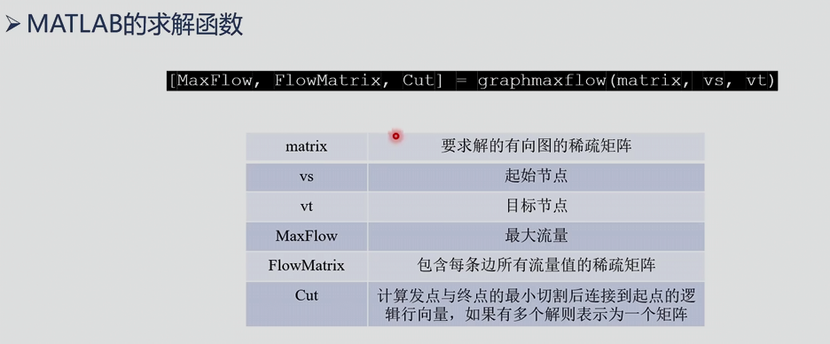

## 代码实现

~~~matlab
%% 用标号发求解网络最大流问题,注意由于版本问题graphmaxflow函数不能被调用
% 构建邻接矩阵
a = zeros(7);
a(1,2) = 4; a(1,4) = 3; a(1,5) = 10;
a(2,3) = 1; a(2,4) = 3; a(4,3) = 4;
a(5,4) = 3; a(4,6) = 5; a(5,6) = 4;
a(6,3) = 2; a(3,7) = 7; a(6,7) = 8;

% 将邻接矩阵转换为有向图对象
G = digraph(a);

% 绘制原图
figure;
plot(G, 'EdgeLabel', G.Edges.Weight); % 使用 plot 函数绘制图，并显示边权重
title('原图');

% 调用 maxflow 函数计算最大流
[MaxFlow, FlowMatrix, Cut] = maxflow(G, 1, 7); % Cut为最小割

% 提取 FlowMatrix 中的边信息
flow_edges = FlowMatrix.Edges; % 提取边信息
flow_weights = flow_edges.Weight; % 提取边权重
flow_sources = flow_edges.EndNodes(:, 1); % 提取源节点
flow_targets = flow_edges.EndNodes(:, 2); % 提取目标节点

% 创建流量图对象
G_flow = digraph(flow_sources, flow_targets, flow_weights);

% 绘制最大流图
figure;
p = plot(G_flow, 'EdgeLabel', G_flow.Edges.Weight); % 绘制最大流图，并显示边权重
title('最大流图');
~~~

# 最小费用最大流问题

## 例题求解

> 每条路限制通过，并且消耗体力，如何让所有人通过所消耗的体力最小？

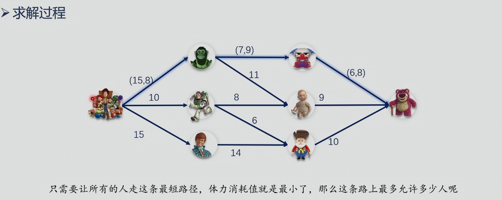

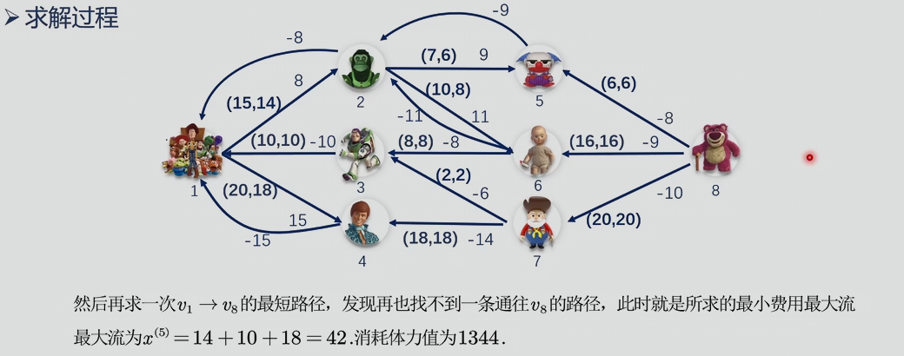

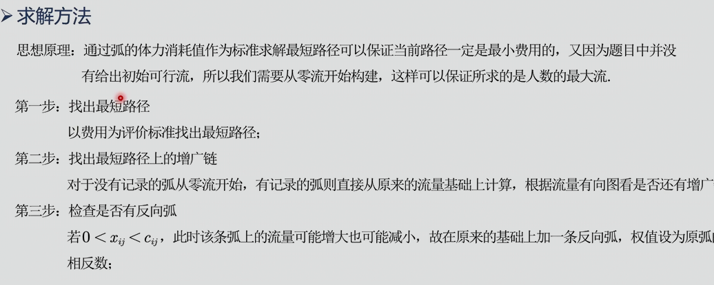


## 代码实现

~~~matlab
%% 求解最小费用最大流问题
% 图的邻接矩阵
c = [0 15 10 20 0 0 0 0;
     0 0 0 0 7 10 0 0;
     0 0 0 0 0 8 2 0;
     0 0 0 0 0 0 18 0;
     0 0 0 0 0 0 0 6;
     0 0 0 0 0 0 0 16;
     0 0 0 0 0 0 0 20;
     0 0 0 0 0 0 0 0;];

 x = zeros(8);

 cost = [+inf 8 10 15 +inf +inf +inf +inf;
 +inf +inf +inf +inf 9 11 +inf +inf;
 +inf +inf +inf +inf +inf 8 6 +inf;
 +inf +inf +inf +inf +inf +inf 14 +inf;
 +inf +inf +inf +inf +inf +inf +inf 8;
 +inf +inf +inf +inf +inf +inf +inf 9;
 +inf +inf +inf +inf +inf +inf +inf 10;
 +inf +inf +inf +inf +inf +inf +inf +inf;];

 cost_all=0;

%% 因为有负权值，不能用dijkstra，我们这里用floyed算法求解
vec = input('请输入发点和终点（例如[1,8]）：');
while (1)
    [path, dis] = Floyd(cost); % 求最短路径
    mypath = [8];
    i = vec(1);
    j = vec(2);
    % 筛选出从发点到终点的路径
    while(path(i,j) ~= 0)
        j = path(i,j);
        mypath = [mypath j];%在原数组后追加元素
    end
    mypath = [1 fliplr(mypath)];% 翻转路径方便求解
    if(size(mypath,2) == 2) %此时再也找不到最短路径
        break;
    end
    % 求最短路上的增广链
    max_x = [+inf];
    for i = 2 : size(mypath,2) %计算增广链的delta
        max_x = [max_x min(max_x(i-1), c(mypath(i-1),mypath(i)) - x(mypath(i-1),mypath(i)))];
    end
    delta = min(max_x);
    for i = 2 : size(mypath,2)
        x(mypath(i-1),mypath(i)) = x(mypath(i-1),mypath(i)) + delta;% 对路径上的弧加流量
        cost_all = cost_all + delta*cost(mypath(i-1),mypath(i));% 计算总耗费
    end
    % 检查是否有反向弧
    for i = 2 : size(mypath,2)
        if(c(mypath(i-1),mypath(i)) == x(mypath(i-1),mypath(i))) % 弧上的流量已满
            cost(mypath(i),mypath(i-1)) = -1*cost(mypath(i-1),mypath(i)); % 增加一条反向弧
            % 取消原弧
            c(mypath(i-1),mypath(i)) = 0;
            cost(mypath(i-1),mypath(i)) = +Inf;
        end
        if(x(mypath(i-1),mypath(i)) < c(mypath(i-1),mypath(i)) && 0 < x(mypath(i-1),mypath(i))) % 弧上的流量未满,且大于0
            cost(mypath(i),mypath(i-1)) = -1*cost(mypath(i-1),mypath(i)); % 增加一条反向弧
        end
    end
end
myplot(cost);

%% 绘制图片
function [] = myplot(gra)
    n = size(gra, 2);
    for i = 1:n
        for j = 1:n
            if gra(i, j) == Inf
                gra(i, j) = 0;
            end
        end
    end
    % 创建有向图对象
    G = digraph(gra);
    % 绘制图形并显示权重
    h = plot(G, 'EdgeLabel', G.Edges.Weight);
    % 设置图形布局
    layout(h, 'force'); % 使用力导向布局
end

%% floyed算法
function [path, dis] = Floyd(gra)
n = size(gra);
dis = gra;
path = zeros(n);
for k  = 1 : n %这是跳板节点
    for i = 1 : n
        for j = 1 :n
            if (dis(i,k) + dis(k,j) < dis(i,j)) % 通过跳板发现了更短的路径，更新最短路径
                dis(i,j) = dis(i,k) + dis(k,j);
                path(i,j) = k;
            end
        end
    end
end

~~~

# 旅行商问题

## 问题求解


## 代码实现

~~~matlab
%% 用改良圈算法求解旅行商问题
A = [0 56 21 35;
     56 0 49 39;
     21 49 0 77;
     35 39 77 0;];

L = size(A,1);%返回向量第一维度的长度
c = [1 2 3 4 1];% 初始圈
for k = 1 : L
    flag = 0;% 修改标志
    for i = 1 : L-2  % i是第一条弧的起点
        for j = i + 2 : L % j是第二条弧的起点
            if( A(c(i),c(j)) + A(c(i+1),c(j+1)) < A(c(i),c(i+1)) + A(c(j),c(j+1)) )
                c(i+1:j) = c(j:-1:i+1);% 翻转中间的路径,j:-1:i+1表示从j到i+1，步长为-1
                flag = flag + 1;
            end
        end
    end
    if(flag == 0) %本轮没有找到2条更短的弧
        long = 0; %圈长
        for i = 1 : L
            long = long + A(c(i),c(i+1));
        end
    end
end
~~~

# 插值算法

## 应用场景介绍


​                                                        ==这里将x看作系数，而不是将a看作系数==


## 常用的插值法

1. 

2. 


3. 


4. 

5. 

## 出现异常(龙格现象)


## 实际应用

1. 一维应用


2. 二维应用


3. n维插值

   

## 代码实现

~~~matlab
%% 一维插值问题
x = 1:10;
y = log(x); %lnx
plot(x,y,'o') % 描点作图
hold on;
new_x = 0.01:0.1:10;
p = pchip(x,y,new_x); % 三次埃尔米特插值法
plot(new_x,p)
hold on;
p = spline(x,y,new_x);% 三次样条插值
plot(new_x,p,'b-')
legend('样本点', '三次埃尔米特插值', '三次样条插值', 'Location', 'SouthEast');

%% 二维插值问题
x = -1:0.5:1;
y = -1:0.5:1;
[x, y] = meshgrid(x, y); % 要先转成网格格式才能插值
z = 1 - x .^2 - y .^ 2;
new_x = -1:0.1:1;
new_y = -1:0.1:1;
[new_x, new_y] = meshgrid(new_x, new_y);
p = interp2(x, y, z, new_x, new_y, 'spline'); % 二维插值，用三次样条插值算法
mesh(new_x, new_y, p)% 绘图之前要确定参数均为网格格式
~~~

# 拟合算法

## 算法介绍


​                                  ==如果样本点不是线性的，可以尝试用非线性的函数进行拟合==


> 评估拟合效果


## 例题解析和代码示例


~~~matlab
%% 绘图
mat = xlsread('data1');
x = mat(:,1);%抽取第一列
y = mat(:,2);%抽取第二列
plot(x,y,'o')

%% 最小二乘法算k和b
n = size(x,1);%返回行数，第二个参数如果是2，返回列数
k = (n*sum(x.*y)-sum(x)*sum(y))/(n*sum(x.*x)-sum(x)*sum(x));
b = (sum(x.*x)*sum(y)-sum(x)*sum(x.*y))/(n*sum(x.*x)-sum(x)*sum(x));
hold on;

xx = 2.5:0.1:7;
yy = k*xx + b;
plot(xx,yy,'-');

%% 预测新冠肺炎确诊数
mat=xlsread("covid.xlsx");
day = mat(1,:);%抽取第一行
num=mat(2,:);
%通过matlab-app中的曲线拟合器进行拟合

%% 黄河小浪底调水调沙问题
%save('water.mat','water')
load('water.mat')
load('sand.mat')
t = [];
for i = 1 : 24
    t = [t 3600*(12*i - 4)];   
end

total_sand = sand .* water; %排沙量

pp = spline(t,total_sand); %返回三次样条插值结果
f = @(t) ppval(pp,t);% 定义了一个匿名函数f，该函数使用ppval函数计算分段多项式的值。
                     % 这个匿名函数可以作为被积函数传递给MATLAB的integral函数，从而计算分段多项式的积分。

q = integral(f,t(1),t(24));% 被积函数、积分上下限

% 绘图看一看
subplot(1,2,1)%将图分成左右两个板块，第三个参数是选择哪个板块，这里是第一个板块
plot(water(1:11),total_sand(1:11),'*')
xlabel('水流量');
ylabel('排沙量');
title('第一阶段')
subplot(1,2,2)%同理，这里是第二个板块
plot(water(12:24),total_sand(12:24),'*')
xlabel('水流量');
ylabel('排沙量');
title('第二阶段');

% 拟合
x1 = water(1:11);
y1 = total_sand(1:11);
x2 = water(12:24);
y2 = total_sand(12:24);
~~~

# 聚类分析

## 简要介绍


## 原理


## 常见算法

### 最短距离系统聚类法


### Kmeans聚类算法

> 聚类网站：https://www.naftaliharris.com/blog/visualizing-k-means-clustering/
> https://kmeans.js.org/
> https://www.naftaliharris.com/blog/visualizing-dbscan-clustering/


### Kmeans++


### dbsca算法

> 基于密度的算法


## 应用


## 代码实现

~~~matlab
%% 使用时修改mydata数据
% Copyright (c) 2015, Yarpiz (www.yarpiz.com)
% All rights reserved. Please read the "license.txt" for license terms.
%
% Project Code: YPML110
% Project Title: Implementation of DBSCAN Clustering in MATLAB
% Publisher: Yarpiz (www.yarpiz.com)
% 
% Developer: S. Mostapha Kalami Heris (Member of Yarpiz Team)
% 
% Contact Info: sm.kalami@gmail.com, info@yarpiz.com
%

clc;
clear;
close all;

%% Load Data

load mydata;

%% Run DBSCAN Clustering Algorithm

epsilon=0.5;
MinPts=10;
IDX=DBSCAN(X,epsilon,MinPts);

%% Plot Results
PlotClusterinResult(X, IDX);
title(['DBSCAN Clustering (\epsilon = ' num2str(epsilon) ', MinPts = ' num2str(MinPts) ')']);

~~~

# 遗传问题

## 基本原理


### 基本概念介绍


> 终止条件判断方法：可以自己设置迭代次数，或者当误差小于一定值的时候

## 算法分析


> 最大换代数可以理解为上面的迭代次数


## 案例实操


> 变异位不足一位不进行变异，本题的变异位为0.02，4为种群中的个体数，5为每个个体的染色体位数


> 经过多轮迭代后，最终出现适应度最高的染色体


## 代码示例

~~~matlab
% 定义目标函数
objectiveFcn = @(x) -x^2; % 由于 GA 默认是最小化，我们最小化 -x^2 来实现最大化 x^2

% 设置变量的上下界
lb = 0; % 下界
ub = 31; % 上界

% 设置遗传算法选项，包括绘制最佳适应度和适应度多样性的图形
options = optimoptions('ga', 'Display', 'iter', 'PlotFcn', {@gaplotbestf, @gaplotscorediversity});

% 调用遗传算法求解
[x, fval] = ga(objectiveFcn, 1, [], [], [], [], lb, ub, [], options);

% 输出结果
disp('最优解 x = ');
disp(x);
disp('最大值 y = x^2 = ');
disp(-fval); % 注意取反，因为我们最小化了 -x^2
~~~

# 排队论

## 模型背景


## 模型介绍


> 选择总体有限，个体逐个到达，间隔随机，相互独立，输入过程平稳的


> 研究禁止退出和转移


> 等待时间越短，模型越好


## 模型介绍


> 普阿松就是泊松分布


> λ:顾客到达率（单位时间内到达的顾客数）。**μ（Mu）**：服务率（单位时间内能服务的顾客数）。*ρ*=λ/μ,表示服务系统的繁忙程度，ρ 必须小于1，系统才稳定。

### 案例说明

#### M/M/1


~~~matlab
lambda = input('请输入到达率 λ（单位：人/小时）: ');
mu = input('请输入服务率 μ（单位：人/小时）: ');

%% 理论计算
rho = lambda / mu;  % 系统利用率
Lq = rho^2 / (1 - rho);  % 平均队列长度
L = rho / (1 - rho);     % 系统中平均人数
Wq = Lq / lambda;        % 平均等待时间（小时）
W = L / lambda;          % 平均逗留时间（小时）

fprintf('系统利用率 ρ = %.2f\n', rho);
fprintf('平均队列长度 Lq = %.2f 人\n', Lq);
fprintf('系统中平均人数 L = %.2f 人\n', L);
fprintf('平均等待时间 Wq = %.2f 分钟\n', Wq * 60);
fprintf('平均逗留时间 W = %.2f 分钟\n', W * 60);

%% 仿真部分
sim_time = 100;  % 仿真时间（小时）
t = 0;
event_list = [];  % 事件列表：[时间, 类型] 0=到达, 1=离开
queue = [];       % 等待队列
server = 0;       % 服务台状态（结束时间）
arrival_times = [];
wait_times = [];
stay_times = [];

% 初始到达事件
next_arrival = exprnd(1/lambda);
event_list = [next_arrival, 0];

while t < sim_time
    [~, idx] = min(event_list(:,1));
    event = event_list(idx,:);
    event_list(idx,:) = [];
    t = event(1);

    if event(2) == 0  % 到达事件
        arrival_time = t;
        arrival_times = [arrival_times, arrival_time];
        if server <= t
            % 立即服务
            service_time = exprnd(1/mu);
            server = t + service_time;
            wait_time = 0;
            departure_time = server;
            wait_times = [wait_times, wait_time];
            stay_times = [stay_times, departure_time - arrival_time];
            event_list = [event_list; departure_time, 1];
        else
            % 加入队列
            queue = [queue; arrival_time];
        end
        % 安排下一个到达
        next_arrival = t + exprnd(1/lambda);
        event_list = [event_list; next_arrival, 0];
    else  % 离开事件
        if ~isempty(queue)
            arrival_time = queue(1);
            queue(1) = [];
            wait_time = t - arrival_time;
            service_time = exprnd(1/mu);
            departure_time = t + service_time;
            server = departure_time;
            wait_times = [wait_times, wait_time];
            stay_times = [stay_times, departure_time - arrival_time];
            event_list = [event_list; departure_time, 1];
        end
    end
end

%% 绘图展示
figure;

% 图1：到达时间与离开时间
subplot(2,1,1);
n_served = length(stay_times);
plot(arrival_times(1:n_served), 'b.-', 'DisplayName', '到达时间');
hold on;
plot(arrival_times(1:n_served) + stay_times, 'r.-', 'DisplayName', '离开时间');
xlabel('顾客编号');
ylabel('时间（小时）');
title('顾客到达与离开时间');
legend;
grid on;

% 图2：等待时间与停留时间
subplot(2,1,2);
plot(wait_times, 'g.-', 'DisplayName', '等待时间');
hold on;
plot(stay_times, 'm.-', 'DisplayName', '停留时间');
xlabel('顾客编号');
ylabel('时间（小时）');
title('顾客等待时间与停留时间');
legend;
~~~

#### M/M/S


> s个服务台，服务台都忙，排成一队


~~~matlab
s = input('请输入服务台数量 s（例如 2）: ');
lambda = input('请输入顾客到达率 λ（例如 3）: ');
mu = input('请输入服务率 μ（例如 4）: ');

% 理论计算
ro = lambda / mu;
ros = ro / s;

% 计算 p0（系统中0个顾客的概率）
sum1 = 0;
for i = 0:(s-1)
    sum1 = sum1 + (ro^i) / factorial(i);
end
sum2 = (ro^s) / factorial(s) / (1 - ros);
p0 = 1 / (sum1 + sum2);

% 计算其他指标
p = (ro^s) * p0 / factorial(s) / (1 - ros);
Lq = p * ros / (1 - ros);  % 平均队列长度
L = Lq + ro;               % 系统中平均人数
W = L / lambda;            % 平均逗留时间
Wq = Lq / lambda;          % 平均等待时间

% 显示理论结果
fprintf('\n===== 理论计算结果 =====\n');
fprintf('系统利用率: %.2f%%\n', ros * 100);
fprintf('平均队列长度 Lq: %.2f 人\n', Lq);
fprintf('系统中平均人数 L: %.2f 人\n', L);
fprintf('平均逗留时间 W: %.2f 分钟\n', W * 60);
fprintf('平均等待时间 Wq: %.2f 分钟\n', Wq * 60);

%% 仿真
sim_time = 100;  % 仿真时间（分钟）
t = 0;
event_list = [];  % 事件列表：[时间, 类型] 0=到达, 1=离开
queue = [];       % 等待队列
servers = zeros(1, s);  % 每个服务台的结束时间
arrival_times = [];
wait_times = [];
stay_times = [];

% 初始到达事件
next_arrival = exprnd(1/lambda * 60);  % 转换为分钟
event_list = [next_arrival, 0];

while t < sim_time
    [~, idx] = min(event_list(:,1));
    event = event_list(idx,:);
    event_list(idx,:) = [];
    t = event(1);

    if event(2) == 0  % 到达事件
        arrival_time = t;
        arrival_times = [arrival_times, arrival_time];
        [~, free_server] = min(servers);
        if servers(free_server) <= t
            service_time = exprnd(1/mu * 60);
            servers(free_server) = t + service_time;
            wait_time = 0;
            departure_time = servers(free_server);
            wait_times = [wait_times, wait_time];
            stay_times = [stay_times, departure_time - arrival_time];
            event_list = [event_list; departure_time, 1];
        else
            queue = [queue; arrival_time];
        end
        next_arrival = t + exprnd(1/lambda * 60);
        event_list = [event_list; next_arrival, 0];
    else  % 离开事件
        if ~isempty(queue)
            arrival_time = queue(1);
            queue(1) = [];
            wait_time = t - arrival_time;
            service_time = exprnd(1/mu * 60);
            departure_time = t + service_time;
            servers(free_server) = departure_time;
            wait_times = [wait_times, wait_time];
            stay_times = [stay_times, departure_time - arrival_time];
            event_list = [event_list; departure_time, 1];
        end
    end
end

% 绘图：到达与离开时间
figure;
plot(arrival_times, 'b.-', 'DisplayName', '到达时间');
hold on;
plot(arrival_times + stay_times, 'r.-', 'DisplayName', '离开时间');
xlabel('顾客编号');
ylabel('时间（分钟）');
title('顾客到达与离开时间（纵轴距离 = 等待时间）');
legend;
grid on;
~~~

# 多目标规划

## 适用题目


## 模型简介


> 主管衡量每个目标，要引入的值，具体请看下图


> 写论文是记得写出公式


> 如果目标不能完成，通过查文献找到优先因子，根据优先因子看自己要完成那些目标，如果找不到就自己编，说是查到的


## 代码实现

~~~matlab
%% 主程序
goals = [1, -1;
         1, 2;
         8, 10];

A = [2, 1]; b = 11;
lb = zeros(2 + 2*3, 1);  % 2 个变量 + 6 个偏差变量
ub = [];
x0 = [1, 1, zeros(1, 6)];  % 初始值

nPriorities = 3;
x_opt = x0;

for priority = 1:nPriorities
    options = optimoptions('fmincon', 'Display', 'iter', 'Algorithm', 'sqp');
    [x_opt, fval] = fmincon(@(x) goalprog_general(x, priority, goals, A, b, [], [], lb, ub), ...
                            x_opt, [], [], [], [], lb, ub, [], options);
    fprintf('优先级 %d 求解完成，目标函数值: %.4f\n', priority, fval);
end

fprintf('最优解：x1=%.4f, x2=%.4f\n', x_opt(1), x_opt(2));
%% 目标函数
function [f, c, ceq] = goalprog_general(x, priority, goals, A, b, Aeq, beq, lb, ub)
    % 决策变量个数
    nvars = size(goals, 2);
    x_vars = x(1:nvars);           % [x1, x2]
    d_vars = x(nvars+1:end);       % [d1-, d2-, d3-, d1+, d2+, d3+]

    % 转置 x_vars，使得维度合法
    f_vals = goals * x_vars';      % 3×2 * 2×1 = 3×1

    % 偏差变量分拆
    ndev = length(d_vars) / 2;
    d_minus = d_vars(1:ndev);           % 负偏差
    d_plus = d_vars(ndev+1:end);        % 正偏差

    % 设置目标函数：根据优先级最小化对应目标的偏差
    switch priority
        case 1
            f = d_plus(1);         % 优先级1：最小化目标1的正偏差
        case 2
            f = d_minus(2);        % 优先级2：最小化目标2的负偏差
        case 3
            f = d_minus(3);        % 优先级3：最小化目标3的负偏差
        otherwise
            f = 0;
    end

    % 等式约束：f(x) + d- - d+ = 目标值（此处目标值设为 0）
    ceq = [
        f_vals(1) + d_minus(1) - d_plus(1);
        f_vals(2) + d_minus(2) - d_plus(2);
        f_vals(3) + d_minus(3) - d_plus(3);
    ];

    % 不等式约束
    c = A * x_vars' - b;

    % 逐级加锁：优先级已优化完成的偏差设为 0
    switch priority
        case 2
            ceq(end+1) = d_plus(1);      % 第一目标已完成，锁住 d1+
        case 3
            ceq(end+1) = d_plus(1);      % 锁 d1+
            ceq(end+1) = d_minus(2);     % 锁 d2-
    end
end

~~~

# 微分方程

## 基本概念


> 初值在区间起始的地方取

# 马尔科夫预测

## 模型简介 

> 有几种已知的拽太，并且是随机的，未来的状态只与现在有关与过去无关(未来不只有一天)


> Xn的取值是随机的，因为状态是随机,当前的状态可能是一天，也可能是两天

### 适用赛题


## 典型案例


### 代码

~~~matlab
% HMM与天气预测的结合
% 隐状态: 1-晴天, 2-阴天, 3-雨天
% 观测状态: 1-高温, 2-中温, 3-低温

clear all;
clc;

%% 1. 定义HMM参数
% 状态转移概率矩阵 A
% A(i,j) = 从隐状态i转移到隐状态j的概率
A = [0.7, 0.2, 0.1;    % 晴天 -> [晴天, 阴天, 雨天]
     0.5, 0.3, 0.2;    % 阴天 -> [晴天, 阴天, 雨天]
     0.4, 0.2, 0.4];   % 雨天 -> [晴天, 阴天, 雨天]

% 观测概率矩阵 B
% B(i,j) = 在隐状态i下观测到j的概率
B = [0.8, 0.1, 0.1;    % 晴天 -> [高温, 中温, 低温]
     0.3, 0.4, 0.3;    % 阴天 -> [高温, 中温, 低温]
     0.1, 0.2, 0.7];   % 雨天 -> [高温, 中温, 低温]

% 初始状态概率
pi = [0.6, 0.3, 0.1];  % [晴天, 阴天, 雨天]

% 状态和观测标签
state_labels = {'晴天', '阴天', '雨天'};
obs_labels = {'高温', '中温', '低温'};

fprintf('=== HMM天气预测模型 ===\n');
fprintf('隐状态: 天气状况 (晴天, 阴天, 雨天)\n');
fprintf('观测值: 温度水平 (高温, 中温, 低温)\n\n');

%% 2. 显示模型参数
fprintf('状态转移概率矩阵 A:\n');
fprintf('\t\t晴天\t阴天\t雨天\n');
for i = 1:3
    fprintf('%s\t\t%.1f\t%.1f\t%.1f\n', state_labels{i}, A(i,1), A(i,2), A(i,3));
end

fprintf('\n观测概率矩阵 B:\n');
fprintf('\t\t高温\t中温\t低温\n');
for i = 1:3
    fprintf('%s\t\t%.1f\t%.1f\t%.1f\n', state_labels{i}, B(i,1), B(i,2), B(i,3));
end

fprintf('\n初始状态概率:\n');
for i = 1:3
    fprintf('%s: %.1f\n', state_labels{i}, pi(i));
end

%% 3. 定义算法函数

%% 4. 观测序列分析示例
fprintf('\n=== 观测序列分析示例 ===\n');

% 观测序列: 连续5天的温度观测 [高温, 中温, 低温, 低温, 中温]
obs_sequence = [1, 2, 3, 3, 2];  % 1=高温, 2=中温, 3=低温

fprintf('观测序列: ');
for i = 1:length(obs_sequence)
    fprintf('%s ', obs_labels{obs_sequence(i)});
end
fprintf('\n');

% 使用Viterbi算法找到最可能的隐状态序列
[optimal_path, max_prob] = viterbi_decode(A, B, pi, obs_sequence);

fprintf('\n最可能的天气状态序列:\n');
for i = 1:length(optimal_path)
    fprintf('第%d天: %s (观测: %s)\n', i, state_labels{optimal_path(i)}, obs_labels{obs_sequence(i)});
end
fprintf('序列概率: %.6f\n', max_prob);

%% 5. 前向-后向算法计算状态概率
alpha = forward_prob(A, B, pi, obs_sequence);
beta = backward_prob(A, B, obs_sequence);

T = length(obs_sequence);
gamma = zeros(3, T);

for t = 1:T
    gamma(:, t) = alpha(:, t) .* beta(:, t);
    gamma(:, t) = gamma(:, t) / sum(gamma(:, t));
end

fprintf('\n=== 各时刻状态概率分布 ===\n');
fprintf('时刻\t观测\t\t晴天\t阴天\t雨天\n');
for t = 1:T
    fprintf('%d\t%s\t\t%.3f\t%.3f\t%.3f\n', t, obs_labels{obs_sequence(t)}, ...
        gamma(1,t), gamma(2,t), gamma(3,t));
end

%% 6. 天气预测
fprintf('\n=== 天气预测 ===\n');

% 基于最后一天的状态概率分布预测
last_state_prob = gamma(:, end);
next_day_prob = A' * last_state_prob;

fprintf('基于观测序列，明天天气概率:\n');
for i = 1:3
    fprintf('%s: %.3f (%.1f%%)\n', state_labels{i}, next_day_prob(i), next_day_prob(i)*100);
end

% 如果明天观测到不同温度，对应的天气概率
fprintf('\n如果明天观测到不同温度，天气状态的后验概率:\n');
for obs = 1:3
    % 计算后验概率 P(state|obs_tomorrow)
    likelihood = B(:, obs);
    posterior = (next_day_prob .* likelihood) / sum(next_day_prob .* likelihood);
    
    fprintf('\n观测到%s时:\n', obs_labels{obs});
    for i = 1:3
        fprintf('  %s: %.3f (%.1f%%)\n', state_labels{i}, posterior(i), posterior(i)*100);
    end
end

%% 7. 蒙特卡洛模拟
fprintf('\n=== 蒙特卡洛模拟 ===\n');

num_simulations = 1000;
num_days = 30;

% 存储模拟结果
sim_states = zeros(num_simulations, num_days);
sim_observations = zeros(num_simulations, num_days);

rng(42); % 设置随机种子

for sim = 1:num_simulations
    states = zeros(1, num_days);
    observations = zeros(1, num_days);
    
    % 初始状态
    cumsum_pi = cumsum(pi);
    states(1) = find(rand() <= cumsum_pi, 1);
    
    % 根据状态生成观测
    cumsum_B = cumsum(B(states(1), :));
    observations(1) = find(rand() <= cumsum_B, 1);
    
    % 生成序列
    for t = 2:num_days
        % 状态转移
        cumsum_A = cumsum(A(states(t-1), :));
        states(t) = find(rand() <= cumsum_A, 1);
        
        % 生成观测
        cumsum_B = cumsum(B(states(t), :));
        observations(t) = find(rand() <= cumsum_B, 1);
    end
    
    sim_states(sim, :) = states;
    sim_observations(sim, :) = observations;
end

% 统计结果
state_freq = zeros(3, num_days);
obs_freq = zeros(3, num_days);

for t = 1:num_days
    for s = 1:3
        state_freq(s, t) = sum(sim_states(:, t) == s) / num_simulations;
        obs_freq(s, t) = sum(sim_observations(:, t) == s) / num_simulations;
    end
end

fprintf('模拟完成！生成了%d个长度为%d天的序列\n', num_simulations, num_days);

%% 8. 可视化结果
figure('Position', [100, 100, 1400, 1000]);

% 子图1: 转移概率矩阵
subplot(3, 4, 1);
imagesc(A);
colorbar;
colormap(gca, 'cool');
title('状态转移概率矩阵');
xlabel('明天天气');
ylabel('今天天气');
set(gca, 'XTick', 1:3, 'XTickLabel', {'晴', '阴', '雨'});
set(gca, 'YTick', 1:3, 'YTickLabel', {'晴', '阴', '雨'});
% 在每个格子中显示概率值
for i = 1:3
    for j = 1:3
        text(j, i, sprintf('%.1f', A(i,j)), 'HorizontalAlignment', 'center', ...
            'FontSize', 10, 'FontWeight', 'bold', 'Color', 'white');
    end
end

% 子图2: 观测概率矩阵
subplot(3, 4, 2);
imagesc(B);
colorbar;
colormap(gca, 'hot');
title('观测概率矩阵');
xlabel('温度水平');
ylabel('天气状态');
set(gca, 'XTick', 1:3, 'XTickLabel', {'高', '中', '低'});
set(gca, 'YTick', 1:3, 'YTickLabel', {'晴', '阴', '雨'});
% 在每个格子中显示概率值
for i = 1:3
    for j = 1:3
        text(j, i, sprintf('%.1f', B(i,j)), 'HorizontalAlignment', 'center', ...
            'FontSize', 10, 'FontWeight', 'bold', 'Color', 'white');
    end
end

% 子图3: 示例观测序列
subplot(3, 4, 3);
plot(1:length(obs_sequence), obs_sequence, 'ro-', 'LineWidth', 2, 'MarkerSize', 8);
hold on;
plot(1:length(optimal_path), optimal_path, 'bs-', 'LineWidth', 2, 'MarkerSize', 8);
xlabel('天数');
ylabel('状态/观测');
title('观测序列与最优路径');
legend('观测(温度)', '预测(天气)', 'Location', 'best');
set(gca, 'YTick', 1:3, 'YTickLabel', {'1', '2', '3'});
grid on;

% 子图4: 状态概率分布
subplot(3, 4, 4);
bar(gamma');
xlabel('天数');
ylabel('概率');
title('各时刻状态概率分布');
legend('晴天', '阴天', '雨天', 'Location', 'best');
grid on;

% 子图5: 前向概率
subplot(3, 4, 5);
plot(1:T, alpha(1,:), 'b-o', 'LineWidth', 2);
hold on;
plot(1:T, alpha(2,:), 'r-s', 'LineWidth', 2);
plot(1:T, alpha(3,:), 'g-^', 'LineWidth', 2);
xlabel('时刻');
ylabel('前向概率');
title('前向概率演化');
legend('晴天', '阴天', '雨天', 'Location', 'best');
grid on;

% 子图6: 后向概率
subplot(3, 4, 6);
plot(1:T, beta(1,:), 'b-o', 'LineWidth', 2);
hold on;
plot(1:T, beta(2,:), 'r-s', 'LineWidth', 2);
plot(1:T, beta(3,:), 'g-^', 'LineWidth', 2);
xlabel('时刻');
ylabel('后向概率');
title('后向概率演化');
legend('晴天', '阴天', '雨天', 'Location', 'best');
grid on;

% 子图7: 明天天气预测
subplot(3, 4, 7);
bar(next_day_prob, 'FaceColor', [0.5, 0.7, 0.9]);
xlabel('天气状态');
ylabel('概率');
title('明天天气预测');
set(gca, 'XTick', 1:3, 'XTickLabel', {'晴', '阴', '雨'});
grid on;

% 子图8: 不同观测下的后验概率
subplot(3, 4, 8);
posterior_matrix = zeros(3, 3);
for obs = 1:3
    likelihood = B(:, obs);
    posterior = (next_day_prob .* likelihood) / sum(next_day_prob .* likelihood);
    posterior_matrix(:, obs) = posterior;
end
bar(posterior_matrix);
xlabel('天气状态');
ylabel('后验概率');
title('不同观测下的后验概率');
set(gca, 'XTick', 1:3, 'XTickLabel', {'晴', '阴', '雨'});
legend('观测高温', '观测中温', '观测低温', 'Location', 'best');
grid on;

% 子图9: 模拟状态频率演化
subplot(3, 4, 9);
plot(1:num_days, state_freq(1,:), 'b-', 'LineWidth', 2);
hold on;
plot(1:num_days, state_freq(2,:), 'r-', 'LineWidth', 2);
plot(1:num_days, state_freq(3,:), 'g-', 'LineWidth', 2);
xlabel('天数');
ylabel('频率');
title('模拟状态频率演化');
legend('晴天', '阴天', '雨天', 'Location', 'best');
grid on;

% 子图10: 模拟观测频率演化
subplot(3, 4, 10);
plot(1:num_days, obs_freq(1,:), 'b-', 'LineWidth', 2);
hold on;
plot(1:num_days, obs_freq(2,:), 'r-', 'LineWidth', 2);
plot(1:num_days, obs_freq(3,:), 'g-', 'LineWidth', 2);
xlabel('天数');
ylabel('频率');
title('模拟观测频率演化');
legend('高温', '中温', '低温', 'Location', 'best');
grid on;

% 子图11: 稳态分布对比
subplot(3, 4, 11);
% 计算理论稳态分布
[V, D] = eig(A');
[~, idx] = max(real(diag(D)));
steady_state = real(V(:, idx));
steady_state = steady_state / sum(steady_state);

% 模拟稳态分布
sim_steady = mean(state_freq(:, end-9:end), 2);

x = 1:3;
width = 0.35;
bar(x - width/2, steady_state, width, 'FaceColor', [0.7, 0.7, 0.7]);
hold on;
bar(x + width/2, sim_steady, width, 'FaceColor', [0.3, 0.6, 0.8]);
xlabel('天气状态');
ylabel('概率');
title('稳态分布对比');
set(gca, 'XTick', 1:3, 'XTickLabel', {'晴', '阴', '雨'});
legend('理论值', '模拟值', 'Location', 'best');
grid on;

% 子图12: 模型性能评估
subplot(3, 4, 12);
% 计算一个示例序列的对数似然
log_likelihood = zeros(1, T);
for t = 1:T
    log_likelihood(t) = log(sum(alpha(:, t)));
end
plot(1:T, cumsum(log_likelihood), 'k-o', 'LineWidth', 2);
xlabel('时刻');
ylabel('累积对数似然');
title('模型拟合质量');
grid on;

sgtitle('HMM天气预测模型综合分析', 'FontSize', 16, 'FontWeight', 'bold');

fprintf('\n=== 程序运行完成 ===\n');
fprintf('已生成完整的HMM天气预测分析结果和可视化图表\n');

%% 算法函数定义
function alpha = forward_prob(A, B, pi, obs_seq)
    T = length(obs_seq);
    N = size(A, 1);
    alpha = zeros(N, T);
    
    % 初始化
    alpha(:, 1) = pi' .* B(:, obs_seq(1));
    
    % 递推
    for t = 2:T
        for j = 1:N
            alpha(j, t) = sum(alpha(:, t-1) .* A(:, j)) * B(j, obs_seq(t));
        end
    end
end

function beta = backward_prob(A, B, obs_seq)
    T = length(obs_seq);
    N = size(A, 1);
    beta = zeros(N, T);
    
    % 初始化
    beta(:, T) = 1;
    
    % 递推
    for t = T-1:-1:1
        for i = 1:N
            beta(i, t) = sum(A(i, :)' .* B(:, obs_seq(t+1)) .* beta(:, t+1));
        end
    end
end

function [path, prob] = viterbi_decode(A, B, pi, obs_seq)
    T = length(obs_seq);
    N = size(A, 1);
    
    % 初始化
    delta = zeros(N, T);
    psi = zeros(N, T);
    
    delta(:, 1) = pi' .* B(:, obs_seq(1));
    psi(:, 1) = 0;
    
    % 递推
    for t = 2:T
        for j = 1:N
            [delta(j, t), psi(j, t)] = max(delta(:, t-1) .* A(:, j));
            delta(j, t) = delta(j, t) * B(j, obs_seq(t));
        end
    end
    
    % 终止
    [prob, path(T)] = max(delta(:, T));
    
    % 回溯
    for t = T-1:-1:1
        path(t) = psi(path(t+1), t+1);
    end
end
~~~

# 时间序列模型

## 模型介绍


> 时期时间序列可加，时点时间序列不可加


### 自回归模型


### 移动平均模型

> 预测误差，白噪声实际就是误差

### 自回归移动平均模型


### 差分自回归移动平均模型


### 建模步骤


## 案例分析


### 实现平稳性


### 确定P，Q的值


> 评价指标越小越好，aic在样本很大的时候失效


### 模型检验


> 时间序列流程：
>
> 1.判断时间序列是否平稳，不平稳进行差分，平稳了求相关系数
>
> 2.确定p，q的值
>
> 3.模型检验

## 代码展示

~~~python
import pandas as pd
import matplotlib.pyplot as plt

# 导入数据
ChinaBank = pd.read_csv('ChinaBank.csv', index_col='Date', parse_dates=['Date'])
print(ChinaBank.head())

# 提取Close列
ChinaBank.index = pd.to_datetime(ChinaBank.index)
sub = ChinaBank.loc['2014-01':'2014-06', 'Close']
print(sub.head())

# 划分训练测试集
train = sub.loc['2014-01':'2014-03']
test = sub.loc['2014-04':'2014-06']

# 查看训练集的时间序列与数据(只包含训练集)
plt.figure(figsize=(12, 6))
plt.plot(train)
plt.xticks(rotation=45)
plt.show()

# 差分法
ChinaBank['diff_1'] = ChinaBank['Close'].diff(1)  # 1阶差分
ChinaBank['diff_2'] = ChinaBank['diff_1'].diff(1)  # 2阶差分
fig = plt.figure(figsize=(12,10))
#原数据
ax1 = fig.add_subplot(311)
ax1.plot(ChinaBank['Close'])
#1阶差分
ax2 = fig.add_subplot(312)
ax2.plot(ChinaBank['diff_1'])
#2阶差分
ax3 = fig.add_subplot(313)
ax3.plot(ChinaBank['diff_2'])
plt.show()import matplotlib.pyplot as plt

import pandas as pd
import statsmodels.api as sm
from statsmodels.tsa.seasonal import seasonal_decompose
from statsmodels.tsa.stattools import adfuller as ADF

# 计算原始序列、一阶差分序列、二阶差分序列的单位根检验结果
ChinaBank['diff_1'] = ChinaBank['diff_1'].fillna(0)
ChinaBank['diff_2'] = ChinaBank['diff_2'].fillna(0)

timeseries_adf = ADF(ChinaBank['Close'].tolist())
timeseries_diff1_adf = ADF(ChinaBank['diff_1'].tolist())
timeseries_diff2_adf = ADF(ChinaBank['diff_2'].tolist())

# 打印单位根检验结果
print('timeseries_adf : ', timeseries_adf)
print('timeseries_diff1_adf : ', timeseries_diff1_adf)
print('timeseries_diff2_adf : ', timeseries_diff2_adf)

import statsmodels.api as sm#绘制
fig = plt.figure(figsize=(12,7))

ax1 = fig.add_subplot(211)
fig = sm.graphics.tsa.plot_acf(train, lags=20,ax=ax1)
ax1.xaxis.set_ticks_position('bottom') # 设置坐标轴上的数字显示的位置，top:显示在顶部  bottom:显示在底部
#fig.tight_layout()

ax2 = fig.add_subplot(212)
fig = sm.graphics.tsa.plot_pacf(train, lags=20, ax=ax2)
ax2.xaxis.set_ticks_position('bottom')
#fig.tight_layout()
plt.show()#遍历，寻找适宜的参数

import itertools
import numpy as np
import seaborn as sns#确定pq的取值范围
p_min = 0
d_min = 0
q_min = 0
p_max = 5
d_max = 0
q_max = 5#Initialize a DataFrame to store the results,，以BIC准则
results_bic = pd.DataFrame(index=['AR{}'.format(i) for i in range(p_min,p_max+1)],
                           columns=['MA{}'.format(i) for i in range(q_min,q_max+1)])

for p,d,q in itertools.product(range(p_min,p_max+1),
                               range(d_min,d_max+1),
                               range(q_min,q_max+1)):
    if p==0 and d==0 and q==0:
        results_bic.loc['AR{}'.format(p), 'MA{}'.format(q)] = np.nan
        continue
    try:
        model = sm.tsa.ARIMA(train, order=(p, d, q),
                               #enforce_stationarity=False,
                               #enforce_invertibility=False,
                              )
        results = model.fit()
        results_bic.loc['AR{}'.format(p), 'MA{}'.format(q)] = results.bic
    except:
        continue
results_bic#得到结果后进行浮点型转换
results_bic = results_bic[results_bic.columns].astype(float)
#绘制热力图
fig, ax = plt.subplots(figsize=(10, 8))
ax = sns.heatmap(results_bic,
                 mask=results_bic.isnull(),
                 ax=ax,
                 annot=True,
                 fmt='.2f',
                 cmap="Purples"
                 )

ax.set_title('BIC')

plt.show()train_results = sm.tsa.arma_order_select_ic(train, ic=['aic', 'bic'], trend='n', max_ar=8, max_ma=8)

print('AIC', train_results.aic_min_order)
print('BIC', train_results.bic_min_order)
#根据以上求得
p = 1
d = 0
q = 0model = sm.tsa.ARIMA(train, order=(p,d,q))
results = model.fit()
resid = results.resid #获取残差
#绘制
#查看测试集的时间序列与数据(只包含测试集)
fig, ax = plt.subplots(figsize=(12, 5))

ax = sm.graphics.tsa.plot_acf(resid, lags=40,ax=ax)

plt.show()predict_sunspots = results.predict(dynamic=False)
print(predict_sunspots)#查看测试集的时间序列与数据(只包含测试集)
plt.figure(figsize=(12,6))
plt.plot(train)
plt.xticks(rotation=45) #旋转45度
plt.plot(predict_sunspots)
plt.show()#绘图
fig, ax = plt.subplots(figsize=(12, 6))
ax = sub.plot(ax=ax)
#预测数据
predict_sunspots.plot(ax=ax)
plt.show()
~~~

# 动态规划

## 模型原理


## 例题介绍


### 背包问题


## 代码展示

~~~python
def knapsack(weights, values, capacity):
    """
    用于求解0-1背包问题的最大价值
    参数weights：物品的重量列表
    参数values：物品的价值列表
    参数capacity：背包的容量
    返回值：最大价值
    """
    n = len(weights)  # 物品数量
    dp = [[0 for j in range(capacity + 1)] for i in range(n + 1)]  # 初始化动态规划数组

    # 动态规划求解过程
    for i in range(1, n + 1):
        for j in range(1, capacity + 1):
            if j < weights[i - 1]:  # 背包容量小于当前物品重量，不能选择当前物品
                dp[i][j] = dp[i - 1][j]
            else:  # 能选择当前物品，要选择价值更大的方案
                dp[i][j] = max(dp[i - 1][j], dp[i - 1][j - weights[i - 1]] + values[i - 1])
    return dp[n][capacity]
w = input('请输入物品的重量列表，用逗号分隔：')
v = input('请输入物品的价值列表，用逗号分隔：')
c = int(input('请输入背包的容量：'))
weights = [int(x) for x in w.split(',')]  # 将输入的字符串转换为整数列表
values = [int(x) for x in v.split(',')]
res = knapsack(weights, values, c)
print('最大价值为:', res)

~~~

